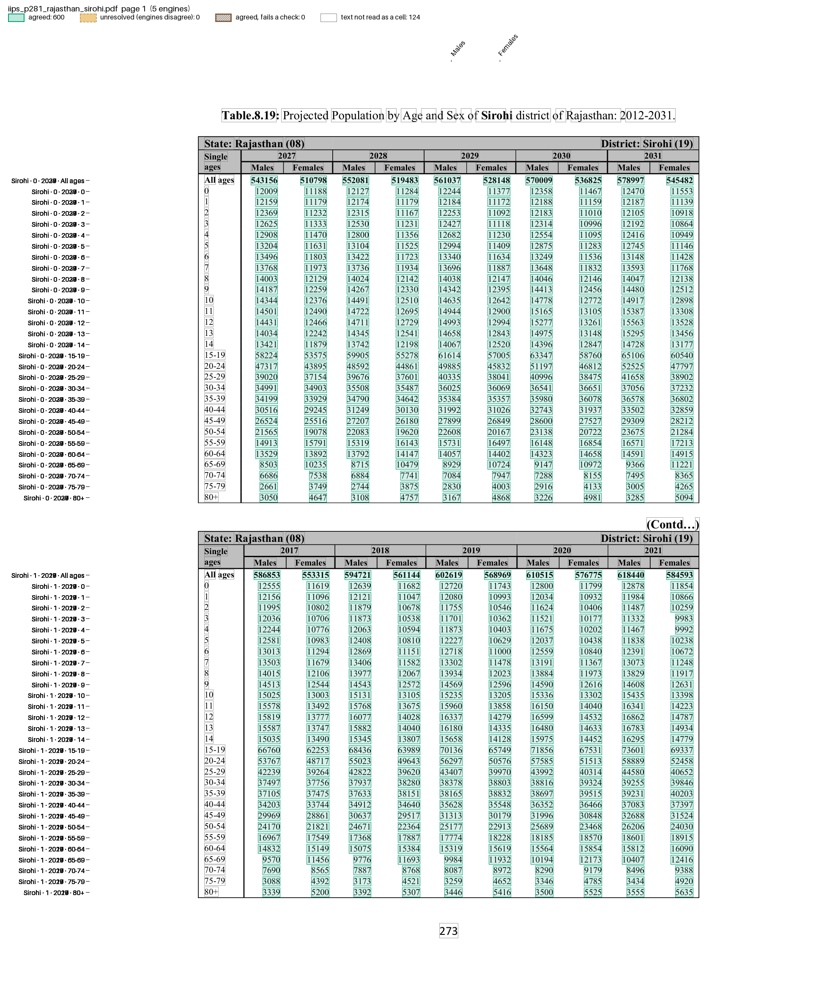
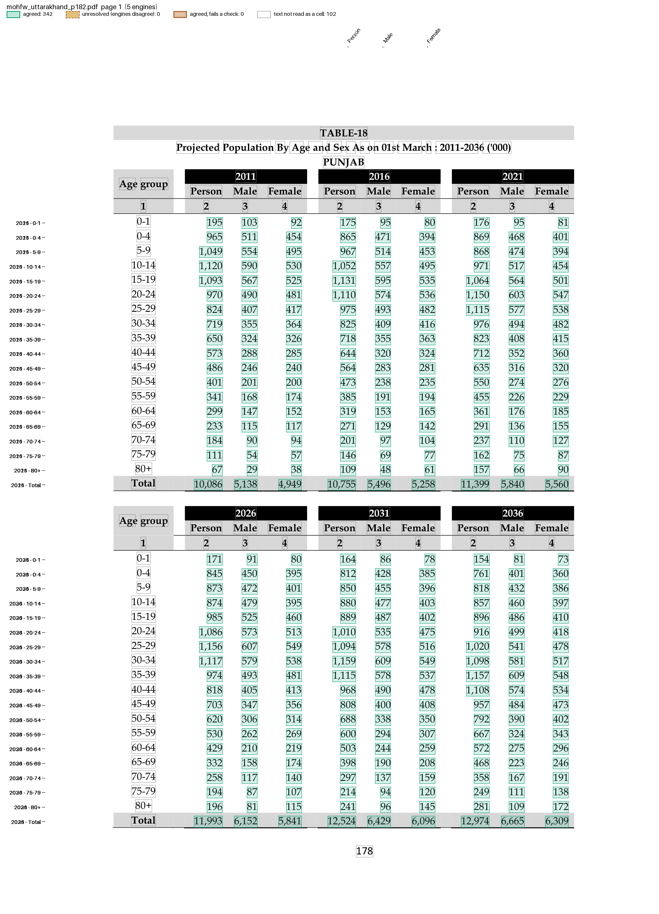

# Population projections

Two reports that censusindia uses for its projections. Both have a text layer, so the five default engines read them, and both carry misprinted headers that the recipes route around.

## IIPS district projections

"Projection of District-Level Annual Population by Quinquennial Age-Group and Sex from 2012 to 2031" (IIPS, 2022) prints each district on two pages, two blocks a page. A block is headed "State: X (NN) District: Y (NN)", then five years of Males and Females for 30 rows: All ages, single ages 0-14, and five-year groups 15-19 to 80+.

The files are in `examples/census_iips_district/`: `recipe.toml` and `iips_district_projection.py`. The fixtures are four pages, in `tests/fixtures/iips/`.

```toml
name = "IIPS district projection"

[engines]
ocr = false

[parser]
type = "custom"
function = "iips_district_projection.py:parse"
key = ["page", "block", "year", "sex", "age"]

# Each age group is rounded to a whole person: 29 of them may miss
# "All ages" by up to 14.5.
[[checks]]
column = "age"
rule = "All ages = rest"
by = ["page", "block", "year", "sex"]
abs_tolerance = 14.5

[output]
layout = "table"
rows = ["district", "block", "year", "age"]
columns = "sex"
format = "csv"
```

```bash
pdfexorcist extract tests/fixtures/iips/iips_p281_rajasthan_sirohi.pdf --recipe examples/census_iips_district/recipe.toml -o sirohi.csv
```

```
Agreed         600  100.0% of cells
Unresolved       0
Checks      1 rule  all passed
```

```
district,block,year,age,header,Males,Females
Sirohi,0,2027,All ages,Sirohi,543156,510798
Sirohi,0,2028,All ages,Sirohi,552081,519483
Sirohi,0,2029,All ages,Sirohi,561037,528148
...
Sirohi,1,2017,All ages,Sirohi,586853,553315
```

`parse()` in `iips_district_projection.py`, in outline (pseudocode):

```text
def parse(pages):
    for page_no, lines in pages:
        blocks = []
        for line in lines:
            "... Age and Sex of Sirohi district of ..." -> title = "Sirohi"
            "State: ... District: Sirohi (13)"          -> header = "Sirohi"
            a line of exactly five years                -> a new block, with those years
            "All ages" or an age (0 ... 14, 15-19 ... 80+) and 10 numbers -> a row of the block
        drop a block that repeats an earlier one exactly (camelot returns some twice)
        for block_no, block in enumerate(blocks):
            the i-th value of a row: year = years[i // 2], sex = Males or Females
            yield {"page", "block": block_no, "year", "sex", "age",
                   "district": title or header, "header", "value"}
```

The headers are not reliable. Sirohi's first block is headed 2027-2031 but holds 2012-2016, so cells are keyed by the block's place on the page and the year as printed. Prakasam's second block is headed "District: Guntur", and Imphal East's blocks "District: Ukhrul", so the district comes from the table title and the printed header is kept as `header`.

`pdfexorcist show tests/fixtures/iips/iips_p281_rajasthan_sirohi.pdf --recipe examples/census_iips_district/recipe.toml -o page.png` draws what the recipe reads:



## MoHFW State projections

Table 18 of "Population Projections for India and States 2011-2036" (MoHFW, 2019) gives one State a page: two blocks of three years (2011, 2016, 2021, then 2026, 2031, 2036), each year a Person, Male and Female column, rows 0-1, 0-4, 5-9 ... 80+ and Total, in thousands with Indian digit grouping (1,19,827).

The files are in `examples/census_mohfw_state/`: `recipe.toml` and `mohfw_state_projection.py`. The fixtures are India and two States, in `tests/fixtures/mohfw/`.

```toml
name = "MoHFW State projection"

[engines]
ocr = false

[parser]
type = "custom"
function = "mohfw_state_projection.py:parse"  # also removes the commas
key = ["year", "age", "sex"]

# Figures are rounded to the thousand, so sums get a tolerance of half a
# thousand per part.
[[checks]]
column = "sex"
rule = "Person = Male + Female"
by = ["year", "age"]
abs_tolerance = 1

[[checks]]
column = "age"
rule = "Total = rest"
by = ["year", "sex"]
where = "age != '0-1'"  # 0-1 is part of 0-4
abs_tolerance = 8.5

[[checks]]
column = "age"
rule = "0-4 >= 0-1"
by = ["year", "sex"]

[output]
layout = "table"
rows = ["year", "age"]
columns = "sex"
format = "csv"
```

```bash
pdfexorcist extract tests/fixtures/mohfw/mohfw_india_p165-166.pdf --recipe examples/census_mohfw_state/recipe.toml -o india.csv
```

```
  pdftotext   342 readings  0.0s
  pdfplumber  342 readings  0.2s
  pymupdf     342 readings  0.0s
  camelot     504 readings  0.5s
  pdfium      342 readings  0.0s

Agreed          342  100.0% of cells
Unresolved        0
Checks      3 rules  all passed
```

```
year,age,title,page,Person,Male,Female
2011,0-1,INDIA,1,24416,12645,11771
2016,0-1,INDIA,1,23739,12532,11207
...
2036,Total,INDIA,2,1518288,775702,742586
```

`parse()` in `mohfw_state_projection.py`, in outline (pseudocode):

```text
def parse(pages):
    years = None
    for page_no, lines in pages:
        for line in lines:
            the line after "Projected Population By Age ..." -> title, e.g. "INDIA"
            a year header ("2026 2031 2036", or "20 26 20 31 20 36") -> years
            an age ("0-4", "80 +", "Total") and exactly 9 numbers:
                the i-th value: year = years[i // 3], sex = Person, Male or Female
                yield {"year", "age", "sex", "title", "page", "value": without commas}
```

The key has no page or title. India's table starts under the end of Table 17, and its 2036 Total row is printed on the next page (`page` 2 above). Uttarakhand's page is titled PUNJAB; its cells still land on their year, age and sex, and `title` keeps the misprint:

```
year,age,title,page,Person,Male,Female
2011,Total,PUNJAB,1,10086,5138,4949
```

`tests/test_iips_district_projection.py` and `tests/test_mohfw_state_projection.py` compare every agreed value with the printed pages, including the cells where censusindia's data differs.

`pdfexorcist show tests/fixtures/mohfw/mohfw_uttarakhand_p182.pdf --recipe examples/census_mohfw_state/recipe.toml -o page.png` draws what the recipe reads:



