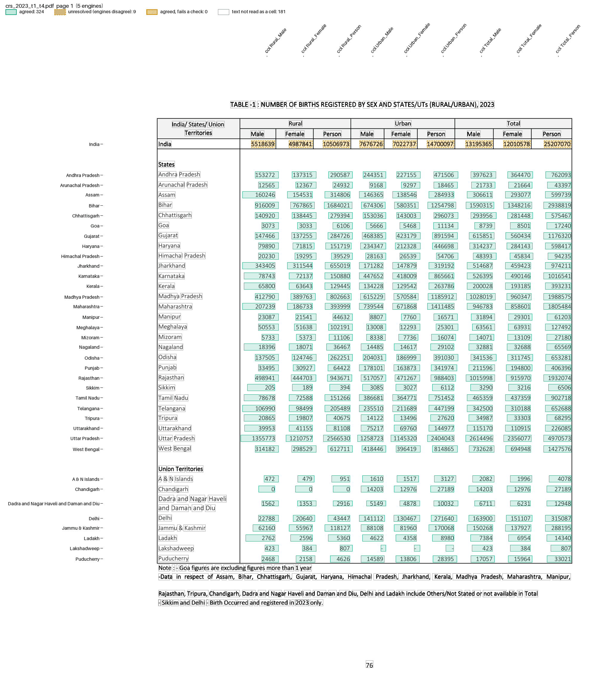

# CRS State Tables 1-4

The annual Civil Registration System (CRS) report prints four State/UT tables of one shape: registered births, deaths, infant deaths and still births. Each row is a State/UT, then Male, Female and Person for Rural, Urban and Total.

The files are in `examples/crs_state_tables/`: `recipe.toml` and `crs_state_table.py`. The fixture holds Table 1 and Table 4 of the 2023 report, in `tests/fixtures/crs/`.

## The recipe

```toml
name = "CRS State Tables 1-4"

[pages]
match = 'TABLE\s*-?\s*[1-4]\s*:\s*NUMBER OF .{0,30}REGISTERED BY SEX'

[engines]
ocr = false  # a text layer: the five default engines, 3 must agree

[parser]
type = "custom"
function = "crs_state_table.py:parse"
key = ["page", "state", "col"]

# ">=" because some States count Others/Not stated only in Person or Total
[[checks]]
column = "sex"
rule = "Person >= Male + Female"
by = ["page", "state", "area"]

[[checks]]
column = "area"
rule = "Total >= Rural + Urban"
by = ["page", "state", "sex"]

[output]
layout = "table"
rows = ["page", "label"]  # one row per table and State/UT
columns = "col"           # Rural_Male ... Total_Person
format = "csv"
```

`match` keeps only the four table pages of a full report. The parser reads rows as the generic parser does, then names each value's `area` and `sex`, so the checks can use them.

`parse()` in `crs_state_table.py`, in outline (pseudocode):

```text
def parse(pages):
    for page_no, lines in pages:
        seen = set()
        for label, values in lines split into text and values:
            skip a line without exactly 9 values
            no label: take the text lines just above and below, if they have no values
            a fake-bold label ("IIIInnnnddddiiiiaaaa") is read once ("India")
            state = the label in lower-case letters; skip it if seen on this page
            for col, value in zip(Rural_Male ... Total_Person, values):
                yield {"page", "state", "col", "label", "area", "sex", "value"}
```

## Run it

```bash
pdfexorcist extract tests/fixtures/crs/crs_2023_t1_t4.pdf --recipe examples/crs_state_tables/recipe.toml -o crs_2023.csv
```

```
  pdftotext   666 readings  0.0s
  pdfplumber  666 readings  0.1s
  pymupdf     648 readings  0.0s
  camelot     648 readings  0.8s
  pdfium      648 readings  0.0s

Agreed          648  97.3% of cells
Unresolved       18  engines disagreed: left blank, not guessed
Checks      2 rules  all passed
```

```
page,label,Rural_Male,Rural_Female,Rural_Person,Urban_Male,Urban_Female,Urban_Person,Total_Male,Total_Female,Total_Person
1,India,,,,,,,,,
1,Andhra Pradesh,153272,137315,290587,244351,227155,471506,397623,364470,762093
1,Arunachal Pradesh,12565,12367,24932,9168,9297,18465,21733,21664,43397
...
1,Dadra and Nagar Haveli and Daman and Diu,1562,1353,2916,5149,4878,10032,6711,6231,12948
1,Lakshadweep,423,384,807,-,-,-,423,384,807
```

`pdfexorcist show tests/fixtures/crs/crs_2023_t1_t4.pdf --recipe examples/crs_state_tables/recipe.toml -o page.png` draws what the recipe reads:



## What is unusual

* The India row is printed in fake bold: each glyph is drawn four times, a little offset. The engines read it differently (pdfplumber reads 5518639 as 5555555511118888666633339999), so its cells are unresolved and listed in the review file.
* "Dadra and Nagar Haveli and Daman and Diu" wraps around its row, half above and half below. A row without a label takes the text lines on either side.
* camelot returns some rows a second time. A State is printed once a page, so the parser keeps its first row.

Every agreed value equals crsindia's PDF-verified data (`tests/test_crs_state_table.py`).
