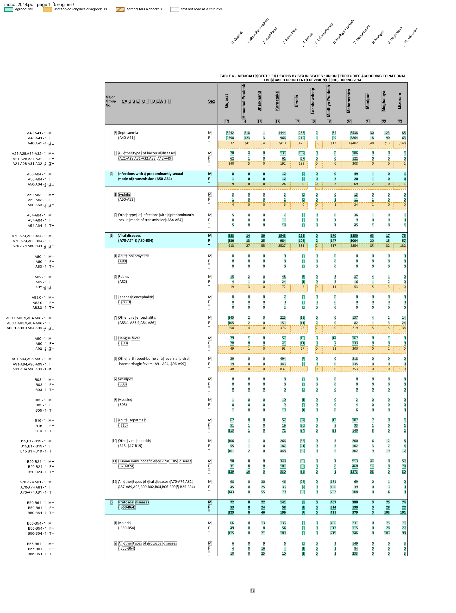

# MCCD Table 4

Table 4 of India's annual report on Medical Certification of Cause of Death (MCCD) gives deaths by cause, sex and State. The generic parsers cannot read it:

* Each cause is a block of M, F and T rows, and its ICD code sits in the label above.
* The State columns are named only by rotated headers, which sit a little off their columns.
* A report spreads the table over several pages, after a contents page that names it too.

The files are in `examples/mccd/`: `table4.toml` and `mccd_table4.py`. The fixtures are single pages from three reports, in `tests/fixtures/mccd/`.

## Run it

```bash
pdfexorcist extract tests/fixtures/mccd/mccd_2009.pdf --recipe examples/mccd/table4.toml -o mccd_2009.csv
```

```
Reading tests/fixtures/mccd/mccd_2009.pdf with 5 engines (a majority must agree), recipe
examples/mccd/table4.toml
  pdftotext   1,596 readings  0.0s
  pdfplumber  1,596 readings  0.2s
  pymupdf     1,596 readings  0.0s
  camelot     1,804 readings  1.1s
  pdfium      1,596 readings  0.1s

Agreed        1,596  88.5% of cells
Unresolved      208  engines disagreed: left blank, not guessed
Checks      2 rules  all passed
```

```
code,pocc,sex,All States (Total),Andhra Pradesh,Andaman & Nicobar Islands,Assam,Bihar,...
A37,1,M,16,0,0,0,0,...
A37,1,F,9,0,0,0,0,...
A37,1,T,25,0,0,0,0,...
```

One row per cause and sex, one column per State. The unresolved cells are readings only camelot made, under keys no other engine produced; see the review file.

`pdfexorcist show tests/fixtures/mccd/mccd_2014.pdf --recipe examples/mccd/table4.toml -o page.png` draws what the recipe reads:



## The recipe

```toml
name = "MCCD Table 4"

[pages]
# Table 4 runs from its title to Table 5's title (that page is left out).
start = 'TABLE\s*[-–]?\s*4\s*[-–:.].*STATES'
stop = 'TABLE\s*[-–]?\s*5\s*[-–:.]'
# select = "21-"   # skip a contents page that names Table 4 too

[engines]
ocr = false  # a text layer: the five default engines, 3 must agree

[parser]
type = "custom"
function = "mccd_table4.py:parse"
key = ["page", "code", "pocc", "sex", "col"]

[postprocess]
function = "mccd_table4.py:name_states"

[[checks]]
column = "sex"
rule = "T >= M + F"
by = ["page", "code", "pocc", "col"]

[[checks]]
column = "state"
rule = "All States (Total) >= rest"
by = ["page", "code", "pocc", "sex"]

[output]
layout = "table"
rows = ["code", "pocc", "sex"]  # one row per cause and sex
columns = "state"               # one column per State
format = "csv"
```

* `[pages]` finds the pages by their titles, so the same recipe works on any year's full report.
* The key is the page, ICD code, the code's occurrence on the page (`pocc`), sex, and the column's place in the row.
* The checks use `>=` rather than `=`, because some reports count transgender deaths in T, and a cell the engines disagreed on is missing from the sum.

## The parser

`parse()` turns one engine's lines into cells. In outline (pseudocode; the full function is in `mccd_table4.py`):

```text
def parse(pages):
    for page_no, lines in pages:
        # the page's usual number of values per row, e.g. 11 States
        ncols = most common value count among the M/F/T rows
        # group lines into blocks: label lines, then an M, an F and a T row
        ...
        for block in blocks:
            code = the ICD code in the block's label, e.g. "A40-A41"
            for sex, values in block["rows"].items():
                for col, value in enumerate(values):
                    yield {"page": page_no, "code": code, "pocc": ..., "sex": sex,
                           "col": col, "value": value}
```

A row without the page's usual number of values yields nothing, so one missing value can never shift the others into the wrong State.

## Naming the States after the vote

The vote runs on `col`, the column's place in the row. `name_states()` then adds a `state` column, read from the page's header with PyMuPDF:

```python
def name_states(cells: pd.DataFrame, pdf: Path) -> pd.DataFrame:
    states = header_states(pdf)  # (page, col) -> State, or None
    return cells.assign(state=[states.get((int(p), int(c))) for p, c in zip(cells.page, cells.col)])
```

`name_states()` reads the States from the header and never assumes them from position: a position-based build once put Maharashtra's 2014 septicaemia deaths (14402) under Lakshadweep, which prints 3. A cell whose State cannot be read keeps `state = None` and is listed for review rather than dropped.

## A page without the total column

The 2014 fixture is the middle page of three, Gujarat to Mizoram, so it has no All States column:

```bash
pdfexorcist extract tests/fixtures/mccd/mccd_2014.pdf --recipe examples/mccd/table4.toml -o mccd_2014.csv
```

```
Agreed          693  87.5% of cells
Unresolved       99  engines disagreed: left blank, not guessed
Checks      2 rules  all passed
Note: check "state 'All States (Total)' >= the rest, within each page, code, pocc, sex"
found no state named 'All States (Total)', so it checked nothing there (state values:
'Gujarat', 'Himachal Pradesh', 'Jharkhand', 'Karnataka', 'Kerala', 'Lakshadweep', 'Madhya
Pradesh', 'Maharashtra', ...)
```

```
code,pocc,sex,Gujarat,Himachal Pradesh,Jharkhand,Karnataka,Kerala,Lakshadweep,Madhya Pradesh,Maharashtra,Manipur,Meghalaya,Mizoram
A40-A41,1,M,3242,218,1,1444,256,2,64,8538,30,123,85
A40-A41,1,F,2390,123,3,966,219,1,49,5864,18,90,63
A40-A41,1,T,5632,341,4,2410,475,3,113,14402,48,213,148
```

A rule that finds nothing to check says so, instead of passing silently. To see this page with a box on every cell, see [See what it extracts](../show.md).

## Make it your own

Copy `table4.toml` and `mccd_table4.py` and edit the Python. `pdfexorcist recipe check table4.toml` imports the Python and names the line of any mistake.

The regression test `tests/test_mccd_table4.py` compares the result on all three fixtures with values checked against the printed pages.

Tables 2, 5 and 9 of the same report are on [MCCD tables](mccd.md). Table 2 uses this parser unchanged.
