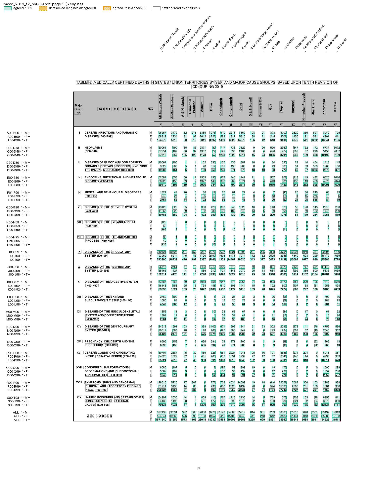
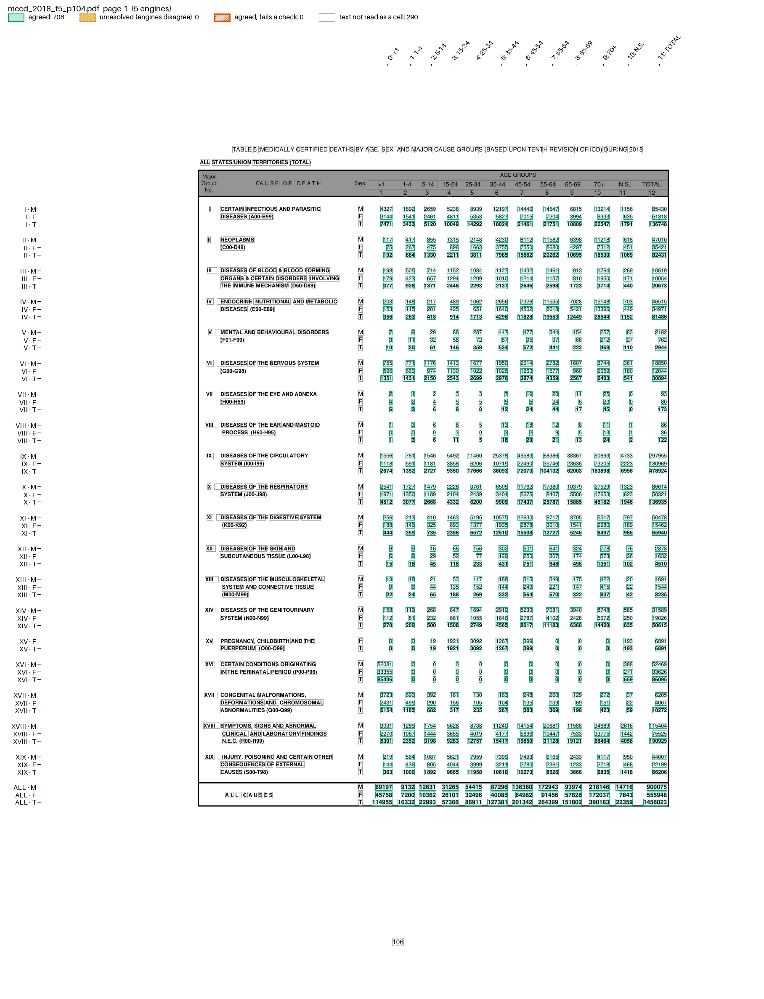
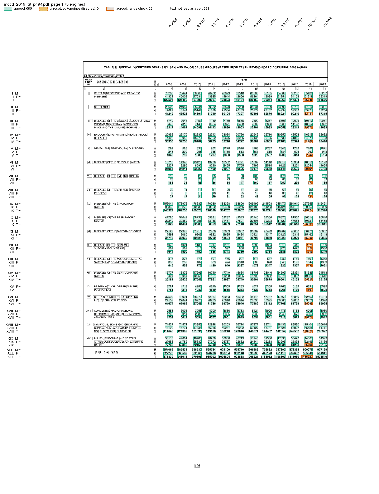

# MCCD tables

India's annual report on Medical Certification of Cause of Death (MCCD) prints most of its tables the same way: each cause is a block of M, F and T rows. The tables differ in their rows (19 ICD-10 chapters or about 100 causes) and in what heads the columns (States, age groups or years).

| Table | Rows | Columns | Parser | Columns named by |
| --- | --- | --- | --- | --- |
| [4](mccd-table4.md) | cause, by ICD code | State, rotated headers | `mccd_table4.py` | `name_states` |
| [2](#table-2-chapters-by-state) | chapter, by ICD range | State, rotated headers | `mccd_table4.py` | `name_states` |
| [5](#table-5-chapters-by-age) | chapter, by Roman numeral | age group, flat header | `mccd_tables.py` | `name_ages` |
| [9](#table-9-chapters-by-year) | chapter, by Roman numeral | year, flat header | `mccd_tables.py` | `name_years` |

The recipes are in `examples/mccd/`, next to both parsers. The fixtures are in `tests/fixtures/mccd/`, and `mccd_tables_manifest.csv` names the report pages they were cut from. In every recipe, `[pages]` finds the table by its title, so the recipe also works on a full report.

## Table 2: chapters by State

Table 2 has Table 4's layout, with chapters for causes: rotated State names over the columns, and the ICD range in each block's label. Table 4's parser reads it unchanged, so the recipe is Table 4's with other `[pages]` patterns:

```toml
name = "MCCD Table 2"

[pages]
start = 'TABLE\s*[-–]?\s*2\s*[-–:.]'
stop = 'TABLE\s*[-–]?\s*3\s*[-–:.]'

[parser]
type = "custom"
function = "mccd_table4.py:parse"
key = ["page", "code", "pocc", "sex", "col"]

[postprocess]
function = "mccd_table4.py:name_states"

# [[checks]] and [output] as in Table 4
```

```bash
pdfexorcist extract tests/fixtures/mccd/mccd_2019_t2_p68-69.pdf --recipe examples/mccd/table2.toml -o table2.csv
```

```
Agreed        2,124  100.0% of cells
Unresolved        0
Checks      2 rules  all passed
```

```
code,pocc,sex,All States (Total),Andhra Pradesh,Andaman & Nicobar Islands,Arunachal Pradesh,Assam,...
A00-B99,1,M,96257,3479,62,218,5369,...
A00-B99,1,F,58319,2234,31,92,2642,...
A00-B99,1,T,154576,5713,93,310,8011,...
C00-D48,1,M,50061,490,85,83,2871,...
```

The fixture is the whole 2019 spread: All States to Kerala on page 68, Lakshadweep to West Bengal on page 69. The ALL CAUSES block has no ICD range, so its key is `ALL`.

`pdfexorcist show tests/fixtures/mccd/mccd_2019_t2_p68-69.pdf --recipe examples/mccd/table2.toml -o page.png` draws what the recipe reads:



## Table 5: chapters by age

One page for all States: the 19 chapters and ALL CAUSES, by sex and by 12 columns (`<1` ... `70+`, `N.S.`, `TOTAL`). The age groups are printed flat above the columns. The labels carry ICD ranges, but Table 9's do not, so `mccd_tables.py` keys both tables by the chapter's Roman numeral:

```text
def parse(pages):
    for page_no, lines in pages:
        ncols = most common value count among the M/F/T rows
        # a block opens at an M row, or when a sex repeats (XV, pregnancy, has only F and T)
        # it owns the label lines read since the previous block's T row
        for block in blocks:
            group = the Roman numeral starting one of its label lines, or "ALL"
            for sex, values in block["rows"].items():
                for col, value in enumerate(values):
                    yield {"page": page_no, "group": group, "sex": sex, "col": col, "value": value}
```

Only a line's first word can be the numeral. The "S E X" heading of Table 9 is set one letter a line, and its lone `X` would otherwise name the first block X.

```toml
name = "MCCD Table 5"

[pages]
start = 'TABLE\s*5\s*:'
stop = 'TABLE\s*6\s*[-–:]'

[parser]
type = "custom"
function = "mccd_tables.py:parse"
key = ["page", "group", "sex", "col"]

[postprocess]
function = "mccd_tables.py:name_ages"  # adds "age": <1, 1-4, ..., 70+, N.S., TOTAL

[[checks]]
column = "sex"
rule = "T >= M + F"
by = ["page", "group", "col"]

[[checks]]
column = "age"
rule = "TOTAL = rest"  # the age groups and N.S. add up to TOTAL
by = ["page", "group", "sex"]

[[checks]]
column = "group"
rule = "ALL = rest"  # the chapters add up to ALL CAUSES
by = ["page", "sex", "col"]

[output]
layout = "table"
rows = ["group", "sex"]
columns = "age"
format = "csv"
```

`name_ages()` takes the first line of the page with five or more words like `<1`, `15-24` or `TOTAL`, and names the columns left to right when the count matches. It is a column named after the vote, as `name_states()` is for Table 4.

```bash
pdfexorcist extract tests/fixtures/mccd/mccd_2018_t5_p104.pdf --recipe examples/mccd/table5.toml -o table5.csv
```

```
Agreed          708  100.0% of cells
Unresolved        0
Checks      3 rules  all passed
```

```
group,sex,<1,1-4,5-14,15-24,25-34,35-44,45-54,55-64,65-69,70+,N.S.,TOTAL
I,M,4327,1892,2659,5238,8939,12197,14446,14547,6815,13214,1156,85430
I,F,3144,1541,2461,4811,5353,5827,7015,7204,3994,9333,635,51318
I,T,7471,3433,5120,10049,14292,18024,21461,21751,10809,22547,1791,136748
...
ALL,T,114955,16332,22993,57366,86911,127381,201342,264399,151802,390183,22359,1456023
```

`pdfexorcist show tests/fixtures/mccd/mccd_2018_t5_p104.pdf --recipe examples/mccd/table5.toml -o page.png` draws what the recipe reads:



## Table 9: chapters by year

Table 5's layout with years for columns (2008 to 2019 in the 2019 report), and no ICD ranges in the labels. The recipe is Table 5's with other `[pages]` patterns, `name_years` and other checks. The parts that differ:

```toml
[pages]
start = 'TABLE\s*9\s*:'
stop = 'TABLE\s*10\s*:'

[postprocess]
function = "mccd_tables.py:name_years"  # adds "year"

[[checks]]
column = "sex"
rule = "T = M + F"
by = ["page", "group", "col"]

[[checks]]
column = "group"
rule = "ALL = rest"
by = ["page", "sex", "col"]

[output]
layout = "table"
rows = ["group", "sex"]
columns = "year"
format = "csv"
```

```bash
pdfexorcist extract tests/fixtures/mccd/mccd_2019_t9_p194.pdf --recipe examples/mccd/table9.toml -o table9.csv
```

```
Agreed         708  100.0% of cells
Unresolved       0
Failed checks   22  agreed values that break a rule
  x group 'ALL' = the rest, within each page, sex, col: 20 cells
  x sex 'T' = M + F, within each page, group, col: 3 cells

Wrote table9.csv (table layout, 59 rows).
Cells to review, with the reason and every engine's reading: table9.review.csv
Some agreed values break a rule (see the failed column), so the exit code is 1.
```

```
group,sex,2008,2009,2010,2011,2012,2013,2014,2015,2016,2017,2018,2019
XII,M,1077,1021,1139,1217,1151,1580,1583,1894,1913,2445,2878,2769
XII,F,567,569,613,669,592,800,917,890,975,1427,1632,1580
XII,T,1644,1590,1752,1886,1743,2380,2500,2784,2888,3872,4910,4349
```

All five engines read 4910, and the page prints 4910. But M + F is 4510, the 2018 report prints 4510, and ALL CAUSES T for 2018 is 400 below the sum of the chapters. The checks catch a misprint in the report; pdfexorcist keeps the value and lists it for review.

`pdfexorcist show tests/fixtures/mccd/mccd_2019_t9_p194.pdf --recipe examples/mccd/table9.toml -o page.png` draws what the recipe reads:



## What the tests found

`tests/test_mccd_tables.py` compares each fixture with mccdindia's data for these tables. Every agreed value matches the page. mccdindia differs from the page in two places, each checked on the rendered page:

* Table 2, 2019, ALL CAUSES on page 69: Nagaland and West Bengal are missing, and Odisha to Uttar Pradesh are shifted one column (Odisha M is 26909; mccdindia has 5751, Puducherry's value).
* Table 5, 2018, ALL CAUSES T: shifted from 55-64 on (65-69 is 151802; mccdindia has 390183, the 70+ value). Chapter XV (pregnancy) is missing in every year.
