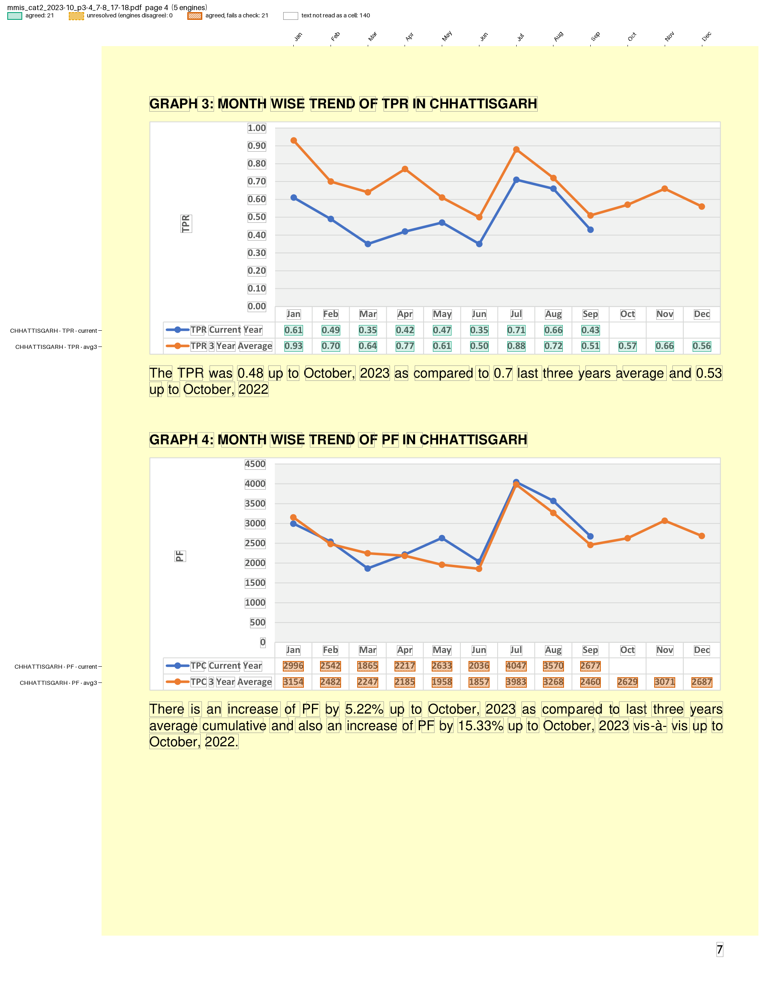

# MMIS monthly malaria situation

The National Center for Vector Borne Diseases Control (NCVBDC) publishes a Monthly Malaria Situation report for each category of States/UTs. The [October 2023 Category II report](https://ncvbdc.mohfw.gov.in/Doc/MMIS/October-2023/MMISReport-Category-II-October-2023.pdf) has 19 pages. Pages 3-4 summarise the category; then each of six States (Chhattisgarh, Jharkhand, Maharashtra, Meghalaya, Odisha, West Bengal) gets two pages. Each of those pages holds two trend graphs, and under each graph is a small table: a row of months, then the `Current Year` and `3 Year Average` values the graph plots. The four indicators are BSE (blood slides examined), TPC (total positive cases), TPR (positivity rate: TPC per 100 slides) and PF (*Plasmodium falciparum* cases).

The table alone does not say which State or indicator it holds. The graph's title above it does: `GRAPH 2: MONTH WISE TREND OF TPC IN CHHATTISGARH`.

The files are in `examples/mmis_malaria/`: `recipe.toml` and `mmis.py`. The fixture is pages 3-4, 7-8 and 17-18 of the October 2023 report (Category II, Chhattisgarh and West Bengal), in `tests/fixtures/mmis/`.

## The recipe

```toml
name = "MMIS monthly malaria situation"

[pages]
match = 'GRAPH \d: MONTH WISE TREND'

[engines]
ocr = false

[parser]
type = "custom"
function = "mmis.py:parse"
key = ["page", "block", "series", "month"]

# TPR is TPC per 100 slides examined, printed to 2 decimals
[[checks]]
function = "mmis.py:tpr"

[[checks]]
function = "mmis.py:pf_within_tpc"

# a table pasted under the wrong graph
[[checks]]
function = "mmis.py:label_matches_title"

[output]
layout = "table"
rows = ["area", "indicator", "series"]
columns = "month"
format = "csv"
```

`match` keeps the graph pages and skips the cover, index, district list, action points and indicator glossary.

The key leaves out the area and indicator. camelot reads each table but not the title above it, so a key holding them would leave camelot out of every vote. A cell is keyed instead by its graph's place on the page (`block` 1 or 2, counted by the month row, which every engine reads), the series and the month. The area, the indicator and the full title are extra columns: each takes the reading most engines agree on, here the four that see the title. `printed` is the indicator named in the row label.

## Run it

```bash
pdfexorcist extract https://ncvbdc.mohfw.gov.in/Doc/MMIS/October-2023/MMISReport-Category-II-October-2023.pdf --recipe examples/mmis_malaria/recipe.toml -o mmis.csv
```

On the whole report, 568 cells across pages 3-4 and 7-18 all agree. On the fixture:

```bash
pdfexorcist extract tests/fixtures/mmis/mmis_cat2_2023-10_p3-4_7-8_17-18.pdf --recipe examples/mmis_malaria/recipe.toml -o mmis.csv
```

```
  pdftotext   232 readings  0.0s
  pdfplumber  232 readings  0.2s
  pymupdf     232 readings  0.0s
  camelot     232 readings  1.1s
  pdfium      232 readings  0.0s

Agreed         232  100.0% of cells
Unresolved       0
Failed checks   21  agreed values that break a rule
  x row label matches the graph title: 21 cells

Wrote mmis.csv (table layout, 24 rows).
```

```
area,indicator,series,printed,graph,Jan,Feb,Mar,...,Sep,Oct,Nov,Dec
CATEGORY II STATES/UTs,BSE,current,BSE,GRAPH 1: MONTH WISE TREND OF BSE IN CATEGORY II STATES/UTs,3549034,3811621,3909330,...,4230022,,,
CATEGORY II STATES/UTs,BSE,avg3,BSE,GRAPH 1: ...,2960192,3029955,3196985,...,3552250,3437172,3445055,3594700
...
CHHATTISGARH,TPC,current,TPC,GRAPH 2: ...,2996,2542,1865,...,2677,,,
CHHATTISGARH,PF,current,TPC,GRAPH 4: ...,2996,2542,1865,...,2677,,,
...
WEST BENGAL,PF,current,PF,GRAPH 4: ...,122,56,66,82,,,,,,,,
```

The current year runs to September (to April in West Bengal); the October cells are empty, as printed.

`pdfexorcist show tests/fixtures/mmis/mmis_cat2_2023-10_p3-4_7-8_17-18.pdf --recipe examples/mmis_malaria/recipe.toml --page 4 -o page.png` draws what the recipe reads on Chhattisgarh's second page:



## The parser

`parse()` in `mmis.py`, in outline (pseudocode):

```text
def parse(pages):
    for page_no, lines in pages:
        for line in lines:
            "GRAPH n: MONTH WISE TREND OF <indicator> IN <area>"  -> the next graph's title
            "Jan Feb ... Dec"                                    -> a new block; it takes the title
            "<BSE|TPC|TPR|PF> <Current Year|3 Year Average>" then up to 12 numbers
                -> yield {"page", "block", "series", "month": Jan, Feb, ..., "value",
                          "area", "indicator" (from the title), "printed" (from the label), "graph"}
```

Values are left-aligned under the months, and only trailing months are ever blank, so the n-th value is the n-th month. The y-axis ticks (`4500000`, `BSE 300000`) do not match a row label and are skipped.

## The checks

* **TPR = 100 × TPC / BSE**, by area, series and month, which ties together the tables of three graphs across two pages. The 3-year averages are printed as whole numbers, so for them TPC and BSE may each be off by half: Meghalaya's August average prints 0.39, while 100 × 160 / 41562 = 0.385. Current-year counts are exact and get no slack.
* **PF ≤ TPC**: falciparum cases are a subset of all positive cases.
* **Row label matches the graph title.** On page 7 of the report (page 4 of the fixture), Chhattisgarh's `GRAPH 4: ... TREND OF PF` has the TPC table under it: rows labelled `TPC Current Year` and `TPC 3 Year Average`, with the TPC graph's numbers, and the line plotted from them. The text below the graph gives PF changes of 5.22% and 15.33%, which these numbers do not support. The 21 cells are agreed, kept as printed, and fail the check, so the run exits with code 1 and lists them in `mmis.review.csv`.

`tests/test_mmis_malaria.py` runs the recipe on the fixture and compares every value with `tests/fixtures/mmis/expected.csv`, which `make_fixtures.py` builds from `pdftotext -layout` independently of the parser.
