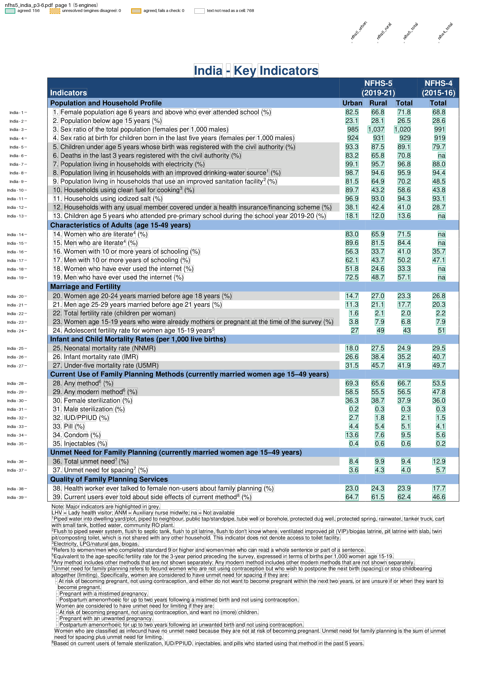
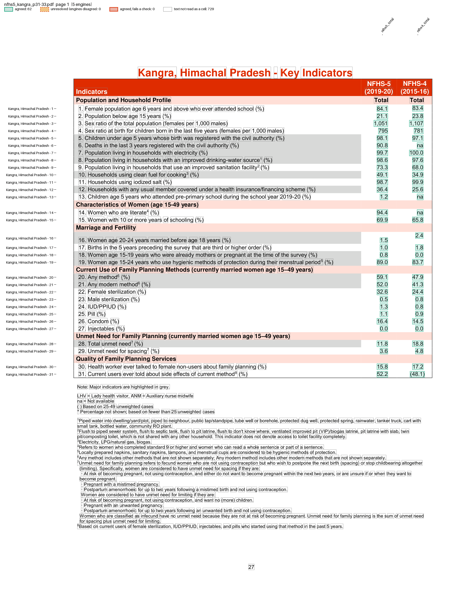

# NFHS-5 fact sheets

India's National Family Health Survey 2019-21 (NFHS-5) publishes "Key Indicators" fact sheets from IIPS. Two recipes read them with one parser:

| Example | Reads |
| --- | --- |
| `examples/nfhs5/state.toml` | The India and State/UT sheet: 131 indicators over four pages, NFHS-5 Urban, Rural and Total, and NFHS-4 Total. |
| `examples/nfhs5/district.toml` | A State's compendium: 104 indicators per district over three pages, NFHS-5 Total and NFHS-4 Total, or NFHS-5 Total alone where NFHS-4 has no comparable estimate. |

The parser is the NFHS-6 one adapted (see [NFHS-6 fact sheets](nfhs6-factsheets.md)): rows by their printed indicator number, a wrapped label's values on a line of their own, and a row yields values only when it holds exactly the page's number of columns. The NFHS-5 sheets add:

* Placeholders `(45.6)` (small sample), `*` (suppressed) and `na` (not available), and numbers such as `1,037` (sex ratio) and `3,385` (Rs.). All are kept as printed.
* A value printed above its row's baseline, which engines read before the row's label (Kangra's row 16).
* Text outside the page box, never printed, right of the table (Raigarh's page 3). The parser drops it.
* A contents page with numbered rows ("1. North Goa  7"), and titles with an en dash or wrapped over two lines.

The fixtures are pages of the IIPS PDFs in `tests/fixtures/nfhs5_state/` and `tests/fixtures/nfhs5_district/`.

## Run it

```bash
pdfexorcist extract tests/fixtures/nfhs5_state/nfhs5_chandigarh_p3-6.pdf --recipe examples/nfhs5/state.toml -o chandigarh.csv
```

```
Reading tests/fixtures/nfhs5_state/nfhs5_chandigarh_p3-6.pdf with 5 engines (a majority must agree),
recipe examples/nfhs5/state.toml
  pdftotext   476 readings  0.0s
  pdfplumber  524 readings  0.5s
  pymupdf     524 readings  0.0s
  camelot     472 readings  1.1s
  pdfium      68 readings  0.1s

Agreed          521  99.4% of cells
Unresolved        3  engines disagreed: left blank, not guessed
Checks      2 rules  all passed

Wrote chandigarh.csv (table layout, 131 rows).
Cells to review, with the reason and every engine's reading: chandigarh.review.csv
```

```
geo,indicator_no,level,nfhs5_urban,nfhs5_rural,nfhs5_total,nfhs4_total
Chandigarh,1,state,86.8,(69.2),86.7,83.7
Chandigarh,6,state,93.6,*,93.6,na
Chandigarh,47,state,"5,586",*,"5,546","2,357"
Chandigarh,68,state,,*,,
```

Row 68 stays blank: camelot reads it with row 40's numbers, and only two engines read it as printed. A district sheet, with the district recipe:

```bash
pdfexorcist extract tests/fixtures/nfhs5_district/nfhs5_kangra_p31-33.pdf --recipe examples/nfhs5/district.toml -o kangra.csv
```

```
Agreed          208  100.0% of cells
Unresolved        0
Checks      2 rules  all passed

Wrote kangra.csv (table layout, 104 rows).
```

```
geo,indicator_no,level,nfhs5_total,nfhs4_total
"Kangra, Himachal Pradesh",3,district,"1,051","1,107"
"Kangra, Himachal Pradesh",16,district,1.5,2.4
"Kangra, Himachal Pradesh",49,district,(83.9),(68.6)
```

`pdfexorcist show tests/fixtures/nfhs5_state/nfhs5_india_p3-6.pdf --recipe examples/nfhs5/state.toml -o page.png` draws what the recipe reads:



`pdfexorcist show tests/fixtures/nfhs5_district/nfhs5_kangra_p31-33.pdf --recipe examples/nfhs5/district.toml -o page.png` draws what the recipe reads:



## The recipe

```toml
name = "NFHS-5 State fact sheet"

[pages]
match = '[-–]\s*Key\s+Indicators'  # "Bihar - Key Indicators", not the contents page

[engines]
ocr = false  # a text layer: the five default engines, 3 must agree

[parser]
type = "custom"
function = "nfhs5_factsheet.py:parse"
key = ["page", "indicator_no", "column"]

[[checks]]
function = "nfhs5_factsheet.py:checks"

[output]
layout = "table"
rows = ["geo", "indicator_no"]  # one row per geography and indicator
columns = "column"              # nfhs5_urban, nfhs5_rural, nfhs5_total, nfhs4_total
format = "csv"
```

The district recipe differs only in its name and sample.

* The key is the page, the printed indicator number and the column. The geography (`geo`, from the page title) is an extra column.
* The checks allow no percentage over 100 (sex ratios, rates per 1,000, TFR and Rs. are not percentages) and require each State Total to lie between its Urban and Rural. TFR and the three child mortality rates are left out of the second rule: they are not ratios of sums, so their Total need not lie between.

Two district pages (Mahisagar and Wardha) skip the number 10 and print 11-32 for indicators 10-31, so "32." appears on two pages. The vote keeps both, since its key holds the page; the table has one row for them, which it leaves blank and lists for review.

## Checked against an independent extraction

`tests/test_nfhs5_factsheet.py` compares the vote with values that two extractions agree on: the vote, and [pratapvardhan/NFHS-5](https://github.com/pratapvardhan/NFHS-5)'s CSVs. Each cell where they differ was read on the rendered page. On the full set (37 State sheets and 36 compendiums from nfhsiips.in):

| | State sheets | District sheets |
| --- | --- | --- |
| Values agreed by the vote | 19,385 of 19,388 | 132,910 of 132,910 (705 districts) |
| Compared with the CSV | 19,385 | 62,710 (its 341 districts) |
| Equal | 19,258 | 62,635 |
| CSV wrong | 0 | 10 (a missed value; 9 bracket notes on `*`, `na` or plain values) |
| Page misprinted | 0 | 65 (the two misnumbered pages) |
| CSV from another edition | 127 (literacy, December 2020) | 0 |

The parser handles each case this check caught it on: one-column pages, the raised value, text outside the page box, title variants and the contents page. The case-by-case table, sources and evidence crops are in `tests/fixtures/nfhs5_state/VERIFICATION.md`.

The NFHS-5 India Report ([FR375](https://dhsprogram.com/pubs/pdf/FR375/FR375.pdf)) prints no fact sheets; its tables by State corroborate the 2021 literacy values. Each of its pages carries the facing page's text outside its box, so read it with `[pages] fit_boxes = false` (or `extract(..., fit_boxes=False)`): growing the box would put two pages' tables side by side. Its tables then need their own parser.

## Sources

IIPS publishes the sheets on [nfhsiips.in](https://www.nfhsiips.in). The fixtures are pages of:

* [India, India fact sheet](https://www.nfhsiips.in/downloadFile.php?link=India.pdf&path=assets%2Fpublication%2FNFHS-5%2FAllFact%2F)
* [Bihar, State/UT fact sheet](https://www.nfhsiips.in/downloadFile.php?link=NFHS-5_StateAndUTFact_Bihar__Bihar.pdf&path=assets%2Fpublication%2FNFHS-5%2FStateAndUTFact%2FBihar%2F)
* [Chandigarh (UT), State/UT fact sheet](https://www.nfhsiips.in/downloadFile.php?link=NFHS-5_StateAndUTFact_Chandigarh+%28UT%29__Chandigarh.pdf&path=assets%2Fpublication%2FNFHS-5%2FStateAndUTFact%2FChandigarh+%28UT%29%2F)
* [Himachal Pradesh, compendium (districts)](https://www.nfhsiips.in/downloadFile.php?link=NFHS-5_StateFact_Himachal+Pradesh__Himachal_Pradesh.pdf&path=assets%2Fpublication%2FNFHS-5%2FStateFact%2FHimachal+Pradesh%2F)
* [Gujarat, compendium (districts)](https://www.nfhsiips.in/downloadFile.php?link=NFHS-5_StateFact_Gujarat__Gujarat.pdf&path=assets%2Fpublication%2FNFHS-5%2FStateFact%2FGujarat%2F)
* [Andaman &  Nicobar Island (UT), compendium (districts)](https://www.nfhsiips.in/downloadFile.php?link=NFHS-5_StateFact_Andaman+%26++Nicobar+Island+%28UT%29__Andaman_Nicobar_Islands.pdf&path=assets%2Fpublication%2FNFHS-5%2FStateFact%2FAndaman+%26++Nicobar+Island+%28UT%29%2F)
* [Maharashtra, compendium (districts)](https://www.nfhsiips.in/downloadFile.php?link=NFHS-5_StateFact_Maharashtra__Maharashtra.pdf&path=assets%2Fpublication%2FNFHS-5%2FStateFact%2FMaharashtra%2F)

The independent extraction is [pratapvardhan/NFHS-5](https://github.com/pratapvardhan/NFHS-5) at commit `93c67fe`: `NFHS-5-States.csv` and `NFHS-5-Districts.csv`.
