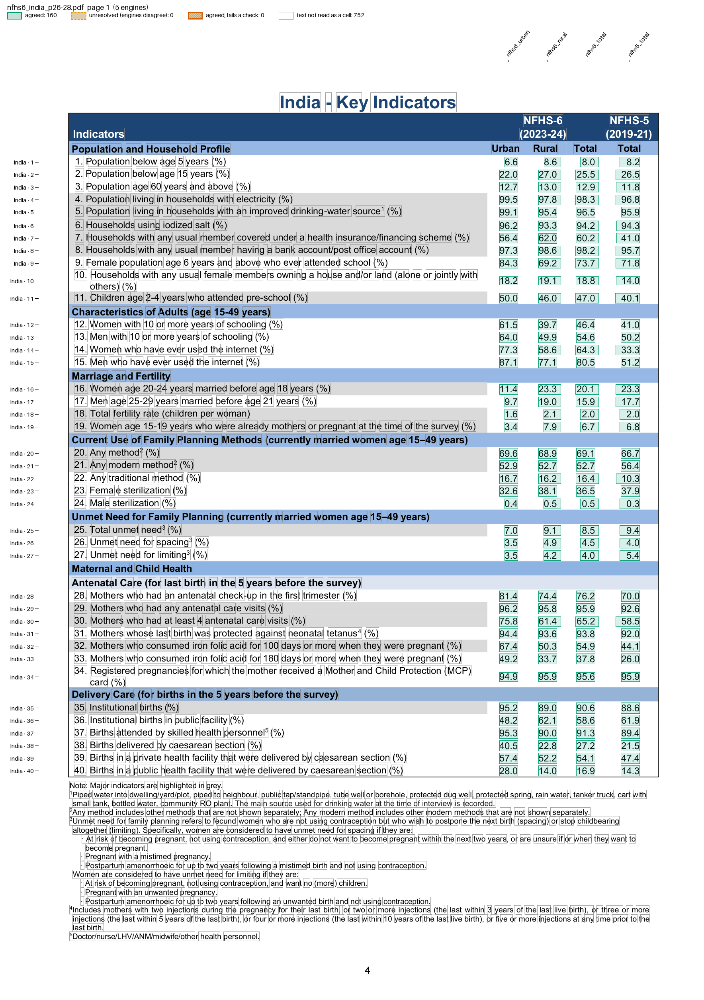
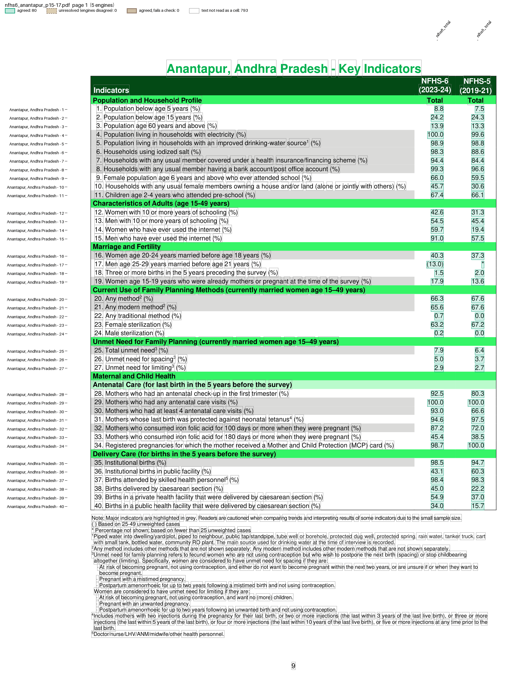

# NFHS-6 fact sheets

India's National Family Health Survey 2023-24 (NFHS-6) publishes "Key Indicators" fact sheets from IIPS. Two recipes read them with one parser:

| Example | Reads |
| --- | --- |
| `examples/nfhs6/state.toml` | The State/UT and India sheet: 101 indicators over three pages, NFHS-6 Urban, Rural and Total, and NFHS-5 Total. |
| `examples/nfhs6/district.toml` | A State's compendium: 93 indicators per district, NFHS-6 Total and NFHS-5 Total, or NFHS-6 Total alone for a district NFHS-5 did not report on. |

The generic parsers cannot read these sheets:

* A row is named by its printed indicator number, and a wrapped label puts the row's values on a line of their own, between its two label lines.
* Some labels are drawn as graphics, so the text layer holds only the bare number ("76", "85"). A bare number is taken only as the next indicator in sequence.
* Footnote marks sit in the labels ("source1", "period18"), and some engines split them off as a cell of their own.
* Placeholders matter: `(45.6)` is a value from a small sample and `*` a suppressed one. Both are kept as printed, and so is a whole number such as `12`.

The fixtures are pages of the IIPS PDFs in `tests/fixtures/nfhs6_state/` and `tests/fixtures/nfhs6_district/`.

## Run it

```bash
pdfexorcist extract tests/fixtures/nfhs6_state/nfhs6_chandigarh_p145-147.pdf --recipe examples/nfhs6/state.toml -o chandigarh.csv
```

```
Reading tests/fixtures/nfhs6_state/nfhs6_chandigarh_p145-147.pdf with 5 engines (a majority must
agree), recipe examples/nfhs6/state.toml
  pdftotext   404 readings  0.0s
  pdfplumber  404 readings  0.4s
  pymupdf     404 readings  0.0s
  camelot     384 readings  0.9s
  pdfium      276 readings  0.0s

Agreed          404  100.0% of cells
Unresolved        0
Checks      2 rules  all passed

Wrote chandigarh.csv (table layout, 101 rows).
```

```
geo,indicator_no,level,nfhs6_urban,nfhs6_rural,nfhs6_total,nfhs5_total
Chandigarh,1,state,6.1,6.1,6.1,5.9
Chandigarh,6,state,96.4,(97.7),96.5,96.8
Chandigarh,11,state,52.5,*,52.6,26.5
Chandigarh,17,state,*,*,*,*
Chandigarh,39,state,*,*,(65.0),(44.3)
```

A district sheet, with the district recipe:

```bash
pdfexorcist extract tests/fixtures/nfhs6_district/nfhs6_anantapur_p15-17.pdf --recipe examples/nfhs6/district.toml -o anantapur.csv
```

```
Agreed          186  100.0% of cells
Unresolved        0
Checks      2 rules  all passed

Wrote anantapur.csv (table layout, 93 rows).
```

```
geo,indicator_no,level,nfhs6_total,nfhs5_total
"Anantapur, Andhra Pradesh",1,district,8.8,7.5
"Anantapur, Andhra Pradesh",4,district,100.0,99.6
"Anantapur, Andhra Pradesh",17,district,(13.0),*
```

`pdfexorcist show tests/fixtures/nfhs6_state/nfhs6_india_p26-28.pdf --recipe examples/nfhs6/state.toml -o page.png` draws what the recipe reads:



`pdfexorcist show tests/fixtures/nfhs6_district/nfhs6_anantapur_p15-17.pdf --recipe examples/nfhs6/district.toml -o page.png` draws what the recipe reads:



## The recipe

```toml
name = "NFHS-6 State fact sheet"

[pages]
match = 'Key\s+Indicators'  # on the whole PDF, only the indicator pages

[engines]
ocr = false  # a text layer: the five default engines, 3 must agree

[parser]
type = "custom"
function = "nfhs6_factsheet.py:parse"
key = ["page", "indicator_no", "column"]

[[checks]]
function = "nfhs6_factsheet.py:checks"

[output]
layout = "table"
rows = ["geo", "indicator_no"]  # one row per geography and indicator
columns = "column"              # nfhs6_urban, nfhs6_rural, nfhs6_total, nfhs5_total
format = "csv"
```

The district recipe differs only in its name and sample: the parser tells the two layouts apart by the number of value columns.

* The key is the page, the printed indicator number and the column. The geography (`geo`, from the page title) is an extra column, so an engine that misses the title still votes.
* The checks allow no percentage over 100 (the State sheet's total fertility rate is not one) and require each State Total to lie between its Urban and Rural. The Total is a weighted mean of the two, and rounding keeps the order, so the rule holds for every printed value.

## The parser

In outline (pseudocode; the full function is in `nfhs6_factsheet.py`):

```text
def parse(pages):
    for page_no, lines in pages:
        ncols = most common number of values ending a numbered row (4, 2 or 1)
        left  = half a column spacing left of the first value column
        for line in lines:
            tokens right of `left` that look like values are values; the rest is label
            "10. Households ..." or "10.Households ..."   -> indicator 10
            a bare "85", when 85 is the next number         -> indicator 85
            values on any line go to the current indicator until it has ncols
        an indicator with exactly ncols values yields them, left to right;
        any other count yields nothing
```

A row with too few or too many values yields nothing, so a value one engine missed can never move into its neighbour's column. A row whose number is graphics too (76 and 77 on some States' pages) is not read: guessing it from the row above would let camelot's repeated rows pass as the next indicator.

## Checked against verified values

`tests/test_nfhs6_factsheet.py` compares the vote with nfhs6's values, which came from its own vote of four extractors over the IIPS PDFs and then PDF-checked fixes. Every cell of the text-layer fixtures is agreed and equal to the printed value, including each cell nfhs6 had to fix by hand. The Tamil Nadu page draws every glyph as a path, so only OCR can read it: Chandra, GLM-OCR and PaddleOCR read every value as printed, Apple Vision missed one row, and Tesseract dropped decimal points (`143` for 14.3). That test runs on request:

```bash
PDFEXORCIST_OCR_TESTS=1 python -m pytest tests/test_nfhs6_factsheet.py -s
```

On a few text-layer pages a value's ".0" is drawn as a path while its digits are text, so every text engine reads `71` where the page prints `71.0` (Assam and Goa, not in the fixtures). The engines agree, so the vote cannot catch it: an OCR engine reading the pixels, or a rule on the number of decimals, can.
