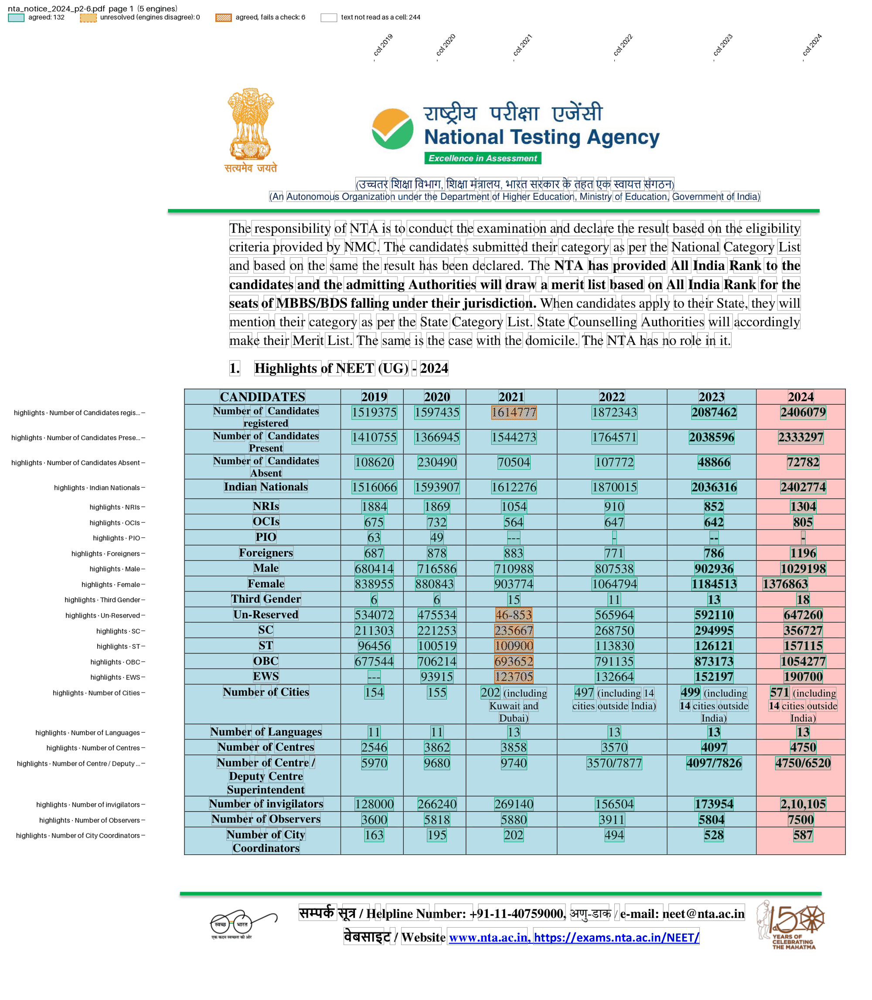

# NEET (UG) 2024 result press release

NTA's [press release of 4 June 2024](https://www.nta.ac.in/Download/Notice/Notice_20240604195244.pdf) announcing the NEET (UG) 2024 result prints nine statistics tables on pages 2-6:

| `table` | Printed as | Rows | Columns |
|---|---|---|---|
| `highlights` | 1. Highlights of NEET (UG) - 2024 | registered, present, nationality, gender, category, cities, centres ... | 2019-2024 |
| `change` | (unnumbered) 2023 vs 2024 | total, gender, category | 2023, 2024, % change |
| `language` | 2. Language-wise | 13 languages | 2019-2024 |
| `gender` | 3. Gender-wise | Male, Female, Third gender, Total | 2023/2024 x registered, appeared, qualified |
| `category` | 4. Category-wise | OBC, SC, ST, General, EWS, Total | the same |
| `pwbd` | 5. PwBD | PwD | the same |
| `nationality` | 6. Nationality-wise | Indian, Foreign Nationals, NRI, OCI, Total | the same |
| `qualifying` | 7. Qualifying criteria | UR/EWS ... ST & PH, Total | criteria, marks range and candidates per year |
| `state` | 8. State-wise (two pages) | 37 States/UTs, Others, Total | 2023/2024 x registered, appeared, qualified |

The rest of the release lists toppers by name; the recipe stops before them.

The files are in `examples/nta_notice/`: `recipe.toml` and `nta_notice.py`. The fixture is pages 2-6, in `tests/fixtures/nta_notice/`.

## The recipe

```toml
name = "NEET (UG) 2024 result press release"

[pages]
match = 'Highlights of NEET|Registered\s+Appeared'  # pages 2-6

[engines]
ocr = false

[normalize]
remove_commas = true  # Table 1 prints 2,10,105 invigilators in 2024

[parser]
type = "custom"
function = "nta_notice.py:parse"
key = ["table", "row", "col"]

[[checks]]
column = "row"
rule = "Number of Candidates registered = Number of Candidates Present + Number of Candidates Absent"
by = ["col"]
where = "table == 'highlights'"

[[checks]]
column = "row"
rule = "Number of Candidates registered = Male + Female + Third Gender"
by = ["col"]
where = "table == 'highlights'"

# 2023 counts present candidates, hence >=; EWS starts in 2020
[[checks]]
column = "row"
rule = "Number of Candidates registered >= Un-Reserved + SC + ST + OBC + EWS"
by = ["col"]
where = "table == 'highlights' and col != '2019'"
missing = "fail"

[[checks]]
column = "row"
rule = "Total = rest"
by = ["table", "col"]
where = "table in ['gender', 'category', 'nationality', 'qualifying', 'state']"

[output]
layout = "table"
rows = ["table", "row"]
columns = "col"
format = "csv"
```

The table name is part of the key, so one run reads all nine tables and the checks pick a table with `where`. The output has one row per table row, tables one after another; each table fills its own columns.

## Run it

```bash
pdfexorcist extract https://www.nta.ac.in/Download/Notice/Notice_20240604195244.pdf --recipe examples/nta_notice/recipe.toml -o neet2024.csv
```

```
  pdftotext   615 readings  0.0s
  pdfplumber  615 readings  0.5s
  pymupdf     615 readings  0.0s
  camelot     615 readings  1.5s
  pdfium      613 readings  0.0s

Agreed         615  100.0% of cells
Unresolved       0
Failed checks    6  agreed values that break a rule
  x Table 1: registered >= categories: 6 cells
```

```
table,row,2019,2020,2021,2022,2023,2024,change_pct,2023_registered,2023_appeared,2023_qualified,2024_registered,2024_appeared,2024_qualified,criteria,2023_marks,2024_marks
highlights,Number of Candidates registered,1519375,1597435,1614777,1872343,2087462,2406079,,,,,,,,,,
...
```

Each table, without the columns it leaves blank:

```
table,row,2019,2020,2021,2022,2023,2024
highlights,Number of Candidates registered,1519375,1597435,1614777,1872343,2087462,2406079
highlights,Un-Reserved,534072,475534,46-853,565964,592110,647260
highlights,Number of Cities,154,155,202,497,499,571

table,row,2023,2024,change_pct
change,Total Candidates,2059006,2406079,16.85
change,Gen-EWS,153363,190694,24.34

table,row,2019,2020,2021,2022,2023,2024
language,English,1204968,1263273,1265520,1476024,1672914,1892355
language,Malayalam,NA,NA,3031,1510,1003,958

table,row,2023_registered,2023_appeared,2023_qualified,2024_registered,2024_appeared,2024_qualified
gender,Third gender,13,11,3,18,17,10
category,EWS,154373,152197,98322,190700,186924,116229
pwbd,PwD,8037,7819,3508,9901,9514,4120
nationality,NRI,877,852,533,1304,1214,798
state,Others (including Outside India),6021,5858,4237,8277,7898,5638
state,Total,2087462,2038596,1145976,2406079,2333297,1316268

table,row,2023_qualified,2024_qualified,criteria,2023_marks,2024_marks
qualifying,UR/EWS,1014372,1165904,50th Percentile,720-137,720-164
qualifying,Total,1145976,1316268,,,
```

`pdfexorcist show tests/fixtures/nta_notice/nta_notice_2024_p2-6.pdf --recipe examples/nta_notice/recipe.toml -o page.png` draws what the recipe reads:



## The parser

`parse()` in `nta_notice.py`, in outline (pseudocode):

```text
def parse(pages):
    table = None
    for line in all lines:
        words = the line's text, "46 - 853" joined to "46-853"
        a header line ("CANDIDATES 2019 ...", "%age change", "Language 2019 ...",
            "Gender Registered ...", "State Name", ...) -> table = its name; next line
        label, values = the words, then the trailing values ("---", "NA" and "720-137" count)
        PwD -> table "pwbd" (camelot drops that table's header)
        name the row:
            Table 1's three "Number of Candidates" rows wrap their last word: by order
            Number of Cities: the first number under each year ("497 (including 14 ...")
            the summary's unlabelled first row: Total Candidates
            Table 7: "UR/EWS 50th Percentile" -> row UR/EWS, criteria 50th Percentile
        skip the line unless it has its table's number of values, or the row was read before
        yield {"table", "row", "col": the column's name, "value"} per value
        the State table's Total ends the run: the top-100 list follows
```

## What is unusual

* Table 1 prints 2021 Un-Reserved as `46-853`. pdfexorcist reads it as printed and the category check fails on 2021; 460853 makes the categories add up to registered.
* Table 1's 2023 category column adds up to present candidates (2038596), not registered, so that check is `>=`.
* The unnumbered summary's 2023 total is 2059006, against 2087462 in Tables 1, 3, 4, 6 and 8, and its gender and category rows do not add up to its total in either year. Nothing there is checked.
* The 2024 languages add up to 2406003, 76 fewer than registered.

`tests/test_nta_notice.py` runs the recipe on the fixture from the command line and compares every value with values typed from the rendered pages.
