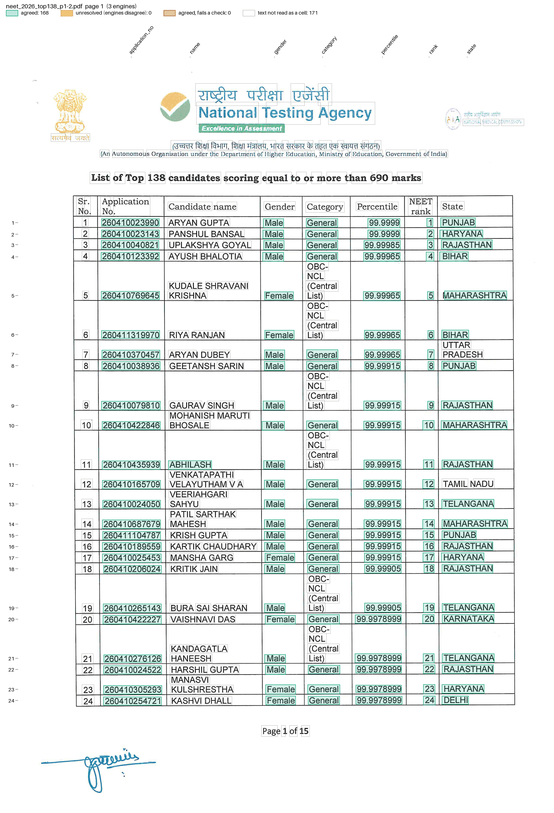

# NTA NEET (UG) toppers

The National Testing Agency's [list of NEET (UG) 2026 re-examination toppers](https://cdnbbsr.s3waas.gov.in/s37bc1ec1d9c3426357e69acd5bf320061/uploads/2026/07/20260716180970800.pdf) opens with "List of Top 138 candidates scoring equal to or more than 690 marks" on pages 1-6. Each row has a Sr. No., Application No., candidate name, gender, category, percentile, NEET rank and State. The pages are 300 dpi scans with no text layer, so only OCR engines can read them. Pages 7-15 hold shorter lists (female, male, EWS, SC ... toppers) and a marks table.

The files are in `examples/nta_toppers/`: `recipe.toml` and `nta_toppers.py`. The fixture is pages 1 and 2, in `tests/fixtures/nta/`.

## The recipe

```toml
name = "NEET (UG) 2026 top 138"

[engines]
use = ["paddleocr", "ocrmac", "glmocr"]

[parser]
type = "custom"
function = "nta_toppers.py:parse"
key = ["sr_no", "field"]

[[checks]]
function = "nta_toppers.py:rank_rises"

[[checks]]
function = "nta_toppers.py:percentile_falls"

[output]
layout = "table"
rows = ["sr_no"]
columns = "field"
format = "csv"
```

Each value is keyed by the printed Sr. No. and its column. Two of the three engines must agree.

## Run it

```bash
pdfexorcist extract https://cdnbbsr.s3waas.gov.in/s37bc1ec1d9c3426357e69acd5bf320061/uploads/2026/07/20260716180970800.pdf \
  --recipe examples/nta_toppers/recipe.toml --pages 1-6 -o neet_top138.csv
```

```
  paddleocr  966 readings  254.9s
  ocrmac     928 readings  7.9s
  glmocr     845 readings  39.2s

Agreed          965  99.9% of cells
Unresolved        1  engines disagreed: left blank, not guessed
Checks      2 rules  all passed
```

A few columns of `neet_top138.csv`:

```
sr_no,rank,percentile,category,state
1,1,99.9999,General,PUNJAB
5,5,99.99965,OBC-NCL (Central List),MAHARASHTRA
25,25,99.9978999,Gen-EWS,GUJARAT
44,44,99.9976999,General,CHANDIGARH (UT)
...
138,138,99.9930996,General,DELHI
```

The unresolved cell is the Application No. of Sr. No. 89: only PaddleOCR reads it. Apple Vision reads that row's percentile as `99.995499šę`, so the parser skips the row, and GLM-OCR leaves out the column.

`pdfexorcist show tests/fixtures/nta/neet_2026_top138_p1-2.pdf --recipe examples/nta_toppers/recipe.toml -o page.png` draws what the recipe reads:



## The parser and the checks

`parse()` in `nta_toppers.py`, in outline (pseudocode):

```text
def parse(pages):
    for each line:
        a "List of ..." title other than the top candidates -> stop reading
        a row's line: a Sr. No. first, then a percentile and the rank after it
            place its tokens by what they are: the 12-digit Application No.,
            Male or Female, the percentile, the rank; the name lies between
            the Application No. and the gender, the category between the
            gender and the percentile, the State after the rank
            add the wrapped words held from the lines above, each to the
            column its x falls in
            yield {"sr_no", "field", "value"} for each column
        upper-case words, or the category's words -> hold as wrapped text
        anything else (letterhead, header, page number) -> drop what is held
```

`rank_rises` fails both ranks of two consecutive rows when the later rank is not higher. `percentile_falls` does the same when the later percentile is higher.

## What is unusual

* Every cell is bottom-aligned, so a wrapped name, "OBC-NCL (Central List)" or a two-word State sits on the lines above its row's numbers. PaddleOCR and Apple Vision return those as lines of their own; GLM-OCR returns each row as one line.
* The category is normalised from however it wrapped or was spaced ("OBC- NCL (Central List)", "OBC-NCL (Central List)").
* Apple Vision reads some decimal points as commas (`99,9930996`); the parser reads them as points.
* GLM-OCR leaves the Application No. column out of some pages and sometimes adds cells after the State (`KERALA | Male | General`). The parser stops the State at the first word that is not in capitals.
* Tesseract is left out: it reads the table rules as text and runs rows together.

`tests/test_nta_toppers.py` compares every agreed value with a hand transcription of pages 1 and 2.
