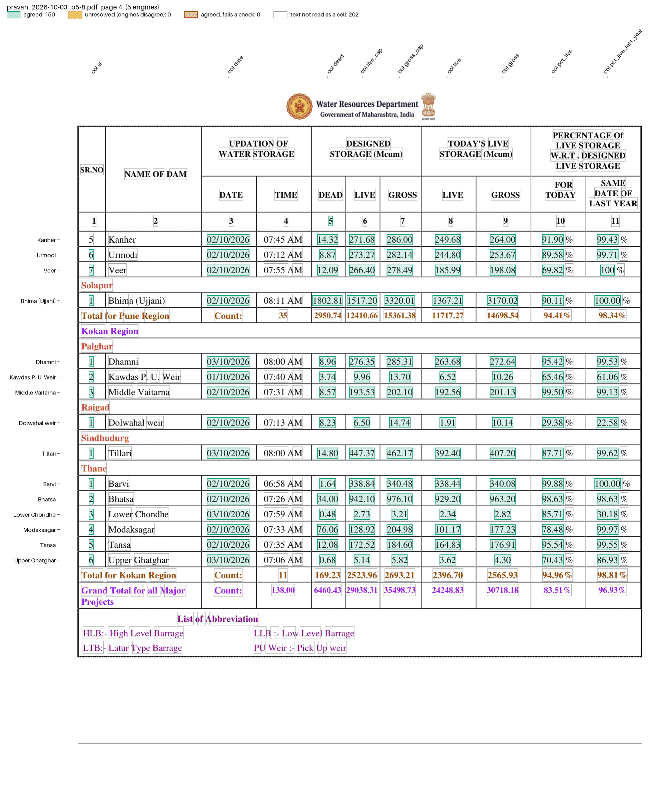

# Pravah dam storage

The Maharashtra Water Resources Department publishes a storage report every morning on its [Pravah dam-safety site](https://mwrdpravah.in/damsafety/control/pdfLatestReportEng). The link serves only the latest report. Pages 1 and 2 summarise storage by region; from page 3 each major dam has a row under its region and district: serial number, name, the date and time of the reading, designed dead, live and gross storage, today's live and gross storage (Mcum), and today's live storage as a % of designed live, today and on the same date last year.

The files are in `examples/pravah_dams/`: `recipe.toml` and `pravah_dams.py`. The fixture is pages 5-8 of the 3 October 2026 report, in `tests/fixtures/pravah/`.

## The recipe

```toml
name = "Pravah dam storage"

[engines]
ocr = false

[parser]
type = "custom"
function = "pravah_dams.py:parse"
key = ["page", "id", "col"]

# designed gross = dead + live; 0.02 for rounding (Pawana prints 272.11 for 272.13)
[[checks]]
column = "col"
rule = "gross_cap = dead + live_cap"
by = ["page", "id"]
abs_tolerance = 0.02

# today's % = 100 * live / designed live, to 2 decimals
[[checks]]
function = "pravah_dams.py:pct_of_live"

[output]
layout = "table"
rows = ["dam"]
columns = "col"
format = "csv"
```

The generic `rows` parser reads nothing here: pdfplumber and PyMuPDF read `98.63 %` as two words, so a row ends in `%`, which is not a value. Serial numbers restart in each district, so `id` is the dam's name in lower case with spaces and punctuation dropped. The printed name, region and district are extra columns.

## Run it

```bash
pdfexorcist extract https://mwrdpravah.in/damsafety/control/pdfLatestReportEng --recipe examples/pravah_dams/recipe.toml -o pravah.csv
```

```
Reading Today's-Storage-ReportEng-03-10-2026.pdf from the link.
  pdftotext   1,380 readings  1.5s
  pdfplumber  1,380 readings  46.9s
  pymupdf     1,380 readings  0.8s
  camelot     1,380 readings  35.6s
  pdfium      1,380 readings  0.6s

Agreed        1,380  100.0% of cells
Unresolved        0
Checks      2 rules  all passed

Wrote pravah.csv (table layout, 138 rows).
```

```
dam,region,district,sr,date,time,dead,live_cap,gross_cap,live,gross,pct_live,pct_live_last_year
Bawanthadi,Nagpur,Bhandara,1,03/10/2026,08:01 AM,25.56,254.69,280.24,84.00,109.56,32.98,98.87
...
Upper Vaitarna,Nashik,Nashik,15,03/10/2026,08:00 AM,22.65,331.31,353.96,324.18,346.84,97.85,99.83
...
Bhatsa,Kokan,Thane,2,02/10/2026,07:26 AM,34.00,942.10,976.10,929.20,963.20,98.63,98.63
Modaksagar,Kokan,Thane,4,02/10/2026,07:33 AM,76.06,128.92,204.98,101.17,177.23,78.48,99.97
Tansa,Kokan,Thane,5,02/10/2026,07:35 AM,12.08,172.52,184.60,164.83,176.91,95.54,99.55
```

On the fixture:

```bash
pdfexorcist extract tests/fixtures/pravah/pravah_2026-10-03_p5-8.pdf --recipe examples/pravah_dams/recipe.toml
```

`pdfexorcist show tests/fixtures/pravah/pravah_2026-10-03_p5-8.pdf --recipe examples/pravah_dams/recipe.toml --page 4 -o page.png` draws what the recipe reads:



## The parser

`parse()` in `pravah_dams.py`, in outline (pseudocode):

```text
def parse(pages):
    for page_no, lines in pages:
        skip the header, down to the column numbers "1 2 3 ... 11"
        for line in lines:
            "Total for ..." or "Grand Total ..."      -> ends the dam above
            a serial, name, date, time, 5 numbers, 2 percentages -> a dam row
            anything else                             -> a loose line, kept for the next row
        before a dam numbered 1, the loose lines are the rest of the previous dam's name,
            then a "... Region" heading, then the district
        before any other dam, they are the rest of the previous dam's name
        each dam: yield {"page", "id", "col": sr ... pct_live_last_year, "value",
                         "dam", "region", "district"} for each value
```

A dam is held until the next row or total, since the rest of its name or the next district heading can be on the following page.

## What is unusual

* Each dam has its own reading date and time; on the 3 October report they run from 30 September to 3 October.
* A long name wraps onto a second line: "Wanjarkheda High" and "level Barrage", with the Parbhani heading right after it. The engines space the second line differently (`LB`, `L B`), so the key ignores spaces.
* The region heading reads "Amravti Region", the total "Total for Amravati Region". The region column keeps the heading as printed.
* Today's gross storage is not always dead + live: Dimbhe prints 383.78 for 382.05, Thokerwadi Tata 392.35 for 363.70 and Sina kolegaon 39.53 for 61.14. The recipe does not check that column.

`tests/test_pravah_dams.py` runs the recipe on the fixture and compares every value with the page.
