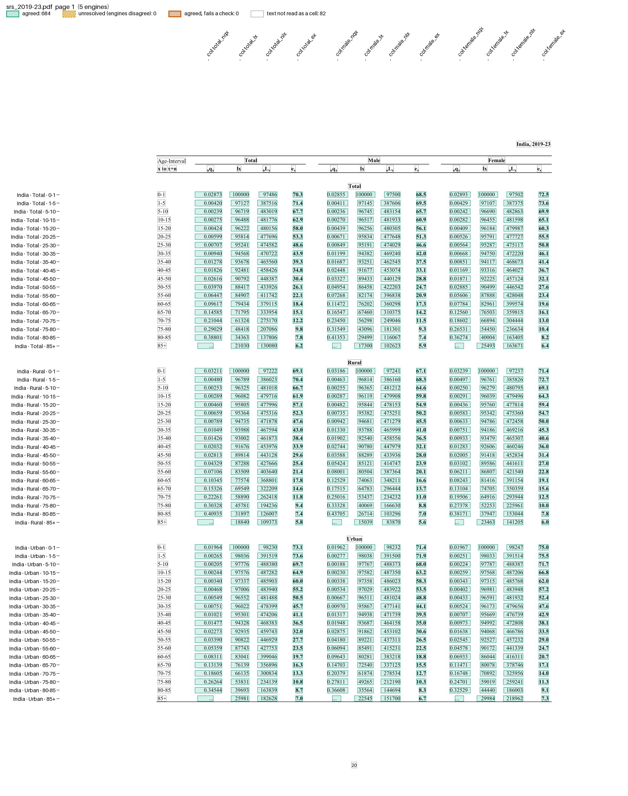

# SRS abridged life tables

The Sample Registration System (SRS) life-table report prints one State a page, titled like "Kerala, 2019-23". Each page has Total, Rural and Urban blocks of 19 age rows (0-1, 1-5, 5-10 ... 85+), and each row has 12 values: nqx, lx, nLx and ex for total, male and female.

The files are in `examples/srs_life_table/`: `recipe.toml` and `srs_life_table.py`. The fixtures are pages of the 2019-23 and 2010-14 reports, in `tests/fixtures/srs/`.

## The recipe

```toml
name = "SRS abridged life table"

[engines]
ocr = false

[parser]
type = "custom"
function = "srs_life_table.py:parse"
key = ["page", "category", "age", "col"]

# l(x+n) = l(x) * (1 - nqx), within 3 for rounding
[[checks]]
function = "srs_life_table.py:survivorship"

[output]
layout = "table"
rows = ["state", "category", "age"]
columns = "col"
format = "csv"
```

The key holds the block and age, not the State. camelot returns the table without the title above it, so a key with the State would leave camelot out of every vote. The parser adds `state` as an extra column, and the output uses it to name rows.

## Run it

```bash
pdfexorcist extract tests/fixtures/srs/srs_2019-23.pdf --recipe examples/srs_life_table/recipe.toml -o srs.csv
```

```
  pdftotext   2,052 readings  0.1s
  pdfplumber  2,052 readings  0.2s
  pymupdf     2,052 readings  0.0s
  camelot     2,052 readings  4.5s
  pdfium      2,052 readings  0.0s

Agreed       2,052  100.0% of cells
Unresolved       0
Checks      1 rule  all passed
```

```
state,category,age,total_nqx,total_lx,total_nlx,total_ex,male_nqx,male_lx,male_nlx,male_ex,female_nqx,female_lx,female_nlx,female_ex
India,Total,0-1,0.02873,100000,97486,70.3,0.02855,100000,97500,68.5,0.02893,100000,97502,72.5
India,Total,1-5,0.00420,97127,387516,71.4,0.00411,97145,387606,69.5,0.00429,97107,387375,73.6
...
West Bengal,Urban,0-1,0.01623,100000,98522,74.8,0.01636,100000,98511,73.5,0.01609,100000,98549,76.3
```

`pdfexorcist show tests/fixtures/srs/srs_2019-23.pdf --recipe examples/srs_life_table/recipe.toml -o page.png` draws what the recipe reads:



## The parser and the check

`parse()` in `srs_life_table.py`, in outline (pseudocode):

```text
def parse(pages):
    for page_no, lines in pages:
        for line in lines:
            label, values = the line's text, then its values
            "Kerala, 2019-23" with no values  -> state = "Kerala"
            "Total", "Rural" or "Urban" alone -> category
            an age label ("0-1" ... "85+") with exactly 12 values, inside a category:
                yield {"page", "category", "age", "col": total_nqx ... female_ex,
                       "state", "value"} for each value
```

`survivorship` is the check, as written:

```python
@check("l(x+n) = l(x) * (1 - nqx)")
def survivorship(df: pd.DataFrame) -> pd.Series:
    """Each age's survivors follow from the previous age's lx and nqx (+/-3 for rounding)."""
```

For each sex and block it compares each age's `lx` with the previous age's `lx * (1 - nqx)`, and marks the three cells involved when they are more than 3 apart.

## What is unusual

* `survivorship` is a check written in Python: each age's lx must follow from the previous age's lx and nqx. A sum rule in TOML cannot express it.
* The 2010-14 report spells the State "Uttrakhand" and prints one Total row as `80+85`. `parse` names the State Uttarakhand and reads the row as 80-85.
* West Bengal's urban female e0 is 76.3 in the re-uploaded 2019-23 report (73.5 in the first upload, per its corrigendum).

`tests/test_srs_life_table.py` compares every agreed value with srsindia's corrected data.
