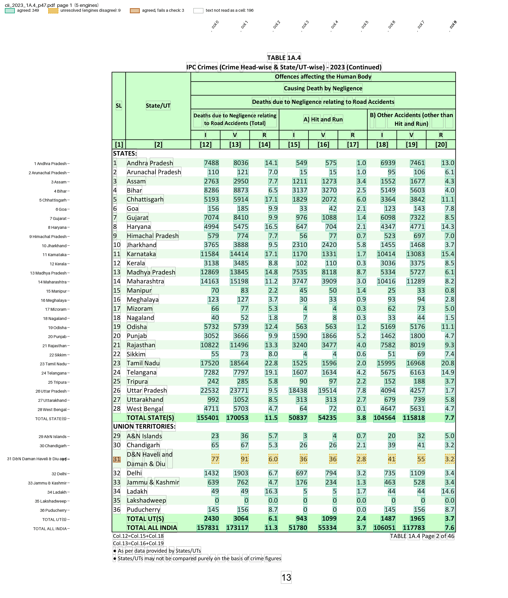
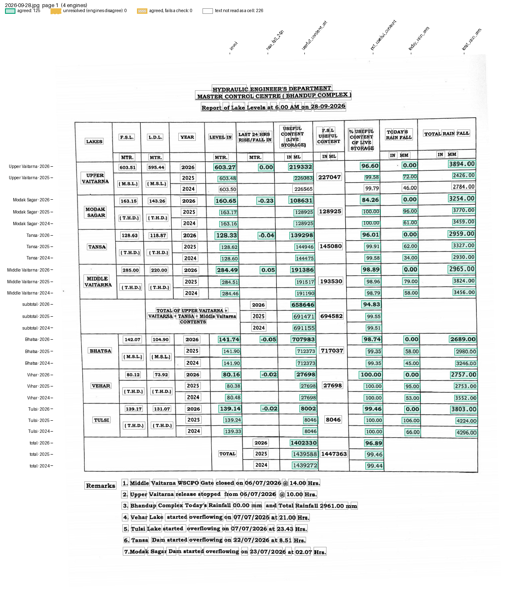

# Recipes

A recipe is a TOML file with everything about one kind of table: its pages, the engines, how numbers are cleaned, how a line becomes cells, and which totals must add up. Make one once and reuse it on next year's report.

Every section is optional. A missing setting keeps the default, as `extract` does without a recipe. Command-line options (`--pages`, `--engines`, ...) override the recipe.

## Make a recipe

`recipe new` asks about the pages, the parser and the totals, tries the answers on a sample, and saves a commented TOML file. Here it runs on the Crime in India fixture; each answer follows its question:

```bash
pdfexorcist recipe new tests/fixtures/cii/cii_2021_1A.1_p43.pdf -o cii.toml
```

```
Which pages hold the table? (e.g. 3-5) (all): 1
Is this a scan or a photo (read it with OCR engines)? [y/n] (n): n

How page 1 reads (the first lines with numbers):
 Label                   ┃ Values
━━━━━━━━━━━━━━━━━━━━━━━━━╇━━━━━━━━━━━━━━━━━━━━━━━━━━━━━━━━━━━━━━━━━━━━━
 Population Crimes (IPC) │ (2021)
 (in Lakhs)              │ (2021)
                         │ (2021)
 1 Andhra Pradesh        │ 119229  188997  179611  528.5  339.9  92.9
 2 Arunachal Pradesh     │ 2590  2244  2626  15.4  170.9  51.7
...
How should values be placed? [rows/columns] (rows): rows
Skip lines with fewer than how many values? (titles, footnotes) (2): 3
A short name for this recipe (cii 2021 1A.1 p43): Crime in India 1A.1

Trying the recipe on page 1 of cii_2021_1A.1_p43.pdf ...
234 values agreed, 0 cells unresolved.
First rows of the result (blank = engines disagreed)
...
Should some values add up to a total (e.g. T = M + F, or States = All India)? [y/n] (n): y
Is the total a row (below or above its parts) or a column (beside them)? [row/column] (row): row
Label of the total row, exactly as printed (TOTAL ALL INDIA): TOTAL ALL INDIA
Labels of the rows that add up to it, separated by + (Enter: all the other rows): TOTAL STATE(S) + TOTAL UT(S)
Must the total equal the sum (=), or be at least the sum (>=)? [=/>=] (=): =
Add another total? [y/n] (n): n
9 values break a rule on the sample pages (marked in the failed column when you run it).
Save the recipe to cii.toml? [y/n] (y): y

Saved cii.toml. Next:
  run it:      pdfexorcist extract tests/fixtures/cii/cii_2021_1A.1_p43.pdf --recipe cii.toml
  read it:     pdfexorcist recipe show cii.toml
  edit it in any text editor; every line is commented.
```

It asks about cleaning only when the sample shows something to clean; this page has no commas or footnote marks. The saved file, without its comments:

```toml
name = "Crime in India 1A.1"
sample = "tests/fixtures/cii/cii_2021_1A.1_p43.pdf"

[pages]
select = "1"

[engines]
ocr = false

[normalize]
remove_commas = false
remove_footnote_marks = false
raised_dots = false
minus_signs = false

[parser]
type = "rows"
min_values = 3

[[checks]]
column = "label"
rule = "TOTAL ALL INDIA = TOTAL STATE(S) + TOTAL UT(S)"
by = ["page", "col"]

[output]
layout = "table"
format = "csv"
```

The values that break the rule are in columns 3 to 5: population is rounded and rates do not add up. [Command line](cli.md#exit-codes) shows that run. Edit the file to fix it, then check it:

```bash
pdfexorcist recipe check cii.toml          # names the line of any mistake
pdfexorcist extract next_year.pdf --recipe cii.toml
```

`recipe new --yes` with options answers the questions from a script; see [recipe new](cli.md#recipe-new).

## Example: a text table

`examples/crime_in_india.toml` is that recipe, edited: `where` limits the first rule to the count columns (0-2), a second rule says no row exceeds All India, and `[normalize]` removes commas and footnote marks. This page prints neither, so `[normalize]` changes nothing here; on a page that prints `1,020` it keeps the sums checkable.

```toml
name = "Crime in India: State/UT table"
description = "Cases by State/UT (columns 0-2: three years), population, rate, charge-sheeting"
sample = "../tests/fixtures/cii/cii_2021_1A.1_p43.pdf"

[engines]
ocr = false  # the PDF has a text layer: the five default engines read it exactly

[normalize]
remove_commas = true          # "1,020" -> "1020", so sums can be checked
remove_footnote_marks = true  # "490+" -> "490"

[parser]
type = "rows"   # a label, then its values in reading order
min_values = 3  # skip titles and footnotes, which carry one or two numbers

[[checks]]
column = "label"   # totals and parts are rows, named by their label
rule = "TOTAL ALL INDIA = TOTAL STATE(S) + TOTAL UT(S)"
by = ["page", "col"]  # checked separately in each column of each page
where = "col <= 2"

[[checks]]
column = "label"
rule = "TOTAL ALL INDIA >= rest"  # no row may exceed the national total
by = ["page", "col"]
where = "col <= 2 and label != 'TOTAL STATE(S)' and label != 'TOTAL UT(S)'"

[output]
layout = "table"  # one row per State/UT, one column per value
format = "csv"
```

```bash
pdfexorcist extract tests/fixtures/cii/cii_2021_1A.1_p43.pdf --recipe examples/crime_in_india.toml -o cii.csv
```

```
Agreed          234  100.0% of cells
Unresolved        0
Checks      2 rules  all passed

Wrote cii.csv (table layout, 39 rows).
```

```
page,label,0,1,2,3,4,5
1,1 Andhra Pradesh,119229,188997,179611,528.5,339.9,92.9
1,2 Arunachal Pradesh,2590,2244,2626,15.4,170.9,51.7
...
1,TOTAL UT(S),329100,285150,327087,388.1,842.7,36.7
1,TOTAL ALL INDIA,3225597,4254356,3663360,13671.8,268.0,72.3
```

`pdfexorcist show tests/fixtures/cii/cii_2023_1A.4_p47.pdf --recipe examples/settings/cii_rows.toml -o page.png` draws what the recipe reads:



## Example: a photographed table

`examples/lake_photo/recipe.toml` reads the lake-level report that Mumbai's water department posts each morning as a photo. Only OCR engines can read it. A row is placed by its YEAR cell, which the generic parsers cannot do, so the recipe names a Python parser next to it (comments trimmed):

```toml
name = "BMC lake levels"
sample = "../../tests/fixtures/bmc/2026-09-28.jpg"

[engines]
use = ["chandra", "glmocr", "paddleocr", "ocrmac"]
min_unopposed = 2  # two identical reads count where the others read nothing

[parser]
type = "custom"
function = "bmc_lake_report.py:parse"
key = ["lake", "year", "field"]

[output]
layout = "table"
rows = ["lake", "year"]  # one row per lake and year
columns = "field"        # level, useful content, % ...
format = "csv"
```

```bash
pdfexorcist extract tests/fixtures/bmc/2026-07-28.jpg --recipe examples/lake_photo/recipe.toml -o lakes.csv
```

```
Reading tests/fixtures/bmc/2026-07-28.jpg with 4 engines (3 must agree), recipe examples/lake_photo/recipe.toml
  chandra    124 readings  0.0s
  glmocr     124 readings  1.8s
  paddleocr  125 readings  24.8s
  ocrmac     110 readings  1.1s

Agreed      125  100.0% of cells
Unresolved    0
```

```
lake,year,level,rise_fall_24h,useful_content_ml,pct_useful_content,today_rain_mm,total_rain_mm,report_date
Upper Vaitarna,2026,601.93,0.13,175993.0,77.51,85.0,2432.0,
Upper Vaitarna,2025,602.2,,184926.0,81.45,31.0,1273.0,
Upper Vaitarna,2024,599.27,,97850.0,43.1,19.0,1293.0,
Modak Sagar,2026,163.16,0.0,128925.0,100.0,57.0,2331.0,
...
total,2026,,,1285449.0,88.81,,,
...
,,,,,,,,2026-07-28
```

`parse()` in `bmc_lake_report.py`, in outline (pseudocode):

```text
def parse(pages):
    years = the latest year printed at least 3 times in the YEAR column, and the two before
    for line in all lines:
        find the YEAR cell; a line without one is skipped
        a line with this year's YEAR starts the next block: a lake, the subtotal or the total
        values = the tokens after the YEAR cell, scan specks ("·", "•") and the lake's printed capacity removed
        skip the line if any value is not a number, or the count is not what the block prints,
        or its % is not useful content / capacity
        yield {"lake": block name, "year": year, "field": field, "value": value} per value
```

A line is never placed by its label, which OCR mangles, and a line with a dropped or extra value yields nothing.

The `chandra` and `glmocr` reads were cached from an earlier run. If an engine reads nothing, `min_agree` does not drop: the others must still reach it. `min_unopposed = 2` also accepts a value two engines read identically where the others read nothing, such as the title date, which Chandra and GLM-OCR do not return. The generic parser with `--ocr` agrees on almost none of this photo's cells, because the engines split its rows differently.

`pdfexorcist show tests/fixtures/bmc/2026-09-28.jpg --recipe examples/lake_photo/recipe.toml -o page.png` draws what the recipe reads:



## Example: MCCD Table 4

`examples/mccd/table4.toml` finds its pages by their title, uses a Python parser, and names each column's State after the vote from rotated headers. See the [worked example](examples/mccd-table4.md).

`pdfexorcist show tests/fixtures/mccd/mccd_2014.pdf --recipe examples/mccd/table4.toml -o page.png` draws what the recipe reads:


## Example: MCCD Tables 2, 5 and 9

`examples/mccd/` reads three more tables of the MCCD report: Table 2 with Table 4's parser, Tables 5 and 9 with a parser keyed by chapter numeral, columns named from the flat header. See [MCCD tables](examples/mccd.md).

`pdfexorcist show tests/fixtures/mccd/mccd_2018_t5_p104.pdf --recipe examples/mccd/table5.toml -o page.png` draws what the recipe reads:


## Example: SRS life tables

`examples/srs_life_table/recipe.toml` reads one State a page, keeps the State out of the key so camelot still votes, and checks survivorship in Python. See [SRS life tables](examples/srs.md).

`pdfexorcist show tests/fixtures/srs/srs_2019-23.pdf --recipe examples/srs_life_table/recipe.toml -o page.png` draws what the recipe reads:


## Example: population projections

`examples/census_iips_district/` and `examples/census_mohfw_state/` read two projection reports whose headers are misprinted, with TOML checks that allow for rounding. See [Population projections](examples/census-projections.md).

`pdfexorcist show tests/fixtures/iips/iips_p281_rajasthan_sirohi.pdf --recipe examples/census_iips_district/recipe.toml -o page.png` draws what the recipe reads:


## Example: CRS State tables

`examples/crs_state_tables/recipe.toml` finds the table pages with `match` and names each value's area and sex for the checks. See [CRS State Tables 1-4](examples/crs.md).

`pdfexorcist show tests/fixtures/crs/crs_2023_t1_t4.pdf --recipe examples/crs_state_tables/recipe.toml -o page.png` draws what the recipe reads:


## Example: NFHS-6 fact sheets

`examples/nfhs6/state.toml` and `examples/nfhs6/district.toml` read the NFHS-6 Key Indicators sheets for India, each State and each district with one Python parser: rows named by their printed indicator number, small-sample `(45.6)` and suppressed `*` values kept as printed. See the [worked example](examples/nfhs6-factsheets.md).

`pdfexorcist show tests/fixtures/nfhs6_state/nfhs6_india_p26-28.pdf --recipe examples/nfhs6/state.toml -o page.png` draws what the recipe reads:


## Example: NFHS-5 fact sheets

`examples/nfhs5/state.toml` and `examples/nfhs5/district.toml` read the NFHS-5 (2019-21) Key Indicators sheets for India, each State and each district, with the NFHS-6 parser adapted to NFHS-5's layout (`na` placeholders, districts without an NFHS-4 column). The values are checked against an independent extraction. See the [worked example](examples/nfhs5-factsheets.md).

`pdfexorcist show tests/fixtures/nfhs5_district/nfhs5_kangra_p31-33.pdf --recipe examples/nfhs5/district.toml -o page.png` draws what the recipe reads:


## Example: Pravah dam storage

`examples/pravah_dams/recipe.toml` reads Maharashtra's daily dam report straight from its link: rows keyed by dam name, wrapped names joined, region and district carried down from their headings, with capacity and % checks. See [Pravah dam storage](examples/pravah.md).

`pdfexorcist show tests/fixtures/pravah/pravah_2026-10-03_p5-8.pdf --recipe examples/pravah_dams/recipe.toml --page 4 -o page.png` draws what the recipe reads:


## Example: several tables in one PDF

`examples/nta_notice/recipe.toml` reads the nine tables of the NEET (UG) 2024 result press release with one parser that keys each value by table, row and column; a check catches a misprinted count. See [NEET (UG) 2024 press release](examples/nta-notice.md).

`pdfexorcist show tests/fixtures/nta_notice/nta_notice_2024_p2-6.pdf --recipe examples/nta_notice/recipe.toml -o page.png` draws what the recipe reads:


## Example: a scanned list

`examples/nta_toppers/recipe.toml` reads a scanned list of NEET toppers with OCR engines: rows keyed by the printed Sr. No., wrapped names, categories and States joined to their row, and checks that ranks rise and percentiles fall. See [NTA NEET toppers](examples/nta.md).

`pdfexorcist show tests/fixtures/nta/neet_2026_top138_p1-2.pdf --recipe examples/nta_toppers/recipe.toml -o page.png` draws what the recipe reads:


## Example: other settings

Small recipes for the settings the examples above leave at their defaults: the `columns` parser, column totals, tolerances, `select`, `fit_boxes`, `min_agree`, `min_unopposed`, `families`, a `[normalize]` function, the cells layout and the xlsx, parquet and json formats. See [Other recipe settings](examples/settings.md).

## Format reference

Every setting is shown below. A real recipe uses a few, and some exclude others: `function` and `key` belong to `type = "custom"`.

```toml
name = "Crime in India: State/UT table"
description = "Cases by State/UT"
sample = "report.pdf"            # the file it was made with (for your reference)

[pages]                          # default: every page
select = "3-5, 9"                # page numbers; "21-" runs to the last page
start = 'TABLE\s*4\s*[-:.].*STATES'  # or: from the first page whose text matches,
stop = 'TABLE\s*5'               #   up to (not including) the next page that matches
match = 'All India'              # only pages whose text matches
fit_boxes = false                # default true: widen a page to cover text drawn outside
                                 #   it; false when that text is another page's

[engines]
use = ["pdfplumber", "pymupdf", "pdfium"]  # default: the installed default engines
ocr = false                      # true: add the installed OCR engines (when use is not given)
min_agree = 3                    # default: a strict majority, at least 3 (2 with families or only OCR engines)
min_unopposed = 2                # also accept a value this many read when none read another (off)
families = { ocr_layer = ["pdfplumber", "pymupdf"] }  # engines that are not independent vote once

[normalize]                      # rewrite every value before the vote
remove_commas = true             # "1,020" -> "1020"
remove_footnote_marks = true     # "490*" -> "490" (a lone "*" placeholder stays)
raised_dots = true               # "65·3" -> "65.3"
minus_signs = true               # "−4" -> "-4"
function = "clean.py:fix"        # your own: value -> new value, or None to drop it

[parser]
type = "rows"                    # "rows": a label, then values in reading order (default)
                                 # "columns": values placed by their position (scans, photos, blank cells)
                                 # "custom": your own function (below)
min_values = 2                   # skip lines with fewer values (titles, footnotes)
tolerance = 0.45                 # "columns" only: how far from a column a value may sit
function = "my_parser.py:parse"  # "custom": pages -> one dict per value
key = ["page", "code", "sex", "col"]  # "custom": the columns that identify a cell

[[checks]]                       # one [[checks]] block per rule; repeat it for more
column = "label"                 # the column naming the total and its parts
rule = "TOTAL ALL INDIA = TOTAL STATE(S) + TOTAL UT(S)"
by = ["page", "col"]             # checked separately within each of these
where = "col <= 2"               # optional: only the cells this pandas query keeps
tolerance = 0.01                 # optional: allowed relative gap (1%)
abs_tolerance = 0.15             # optional: allowed absolute gap (rounded numbers)
missing = "fail"                 # optional: a listed part that is missing fails (default "skip")
name = "States + UTs = India"    # optional: the name written in the failed column

[[checks]]                       # the same rule as total and parts, for a total column:
column = "col"
total = 0                        #   the total's name (text or a number)
parts = [3, 6]                   #   its parts; leave out for "every other"
op = "="                         #   =, >= or <= (default =); not used with rule
value = "value"                  #   the column holding the numbers (default "value")

[[checks]]
function = "my_checks.py:rules"  # your own check, a list of checks, or a function returning them

[postprocess]
function = "my_parser.py:name_states"  # after the vote: (cells, pdf) -> cells, e.g. add a State column

[output]
layout = "table"                 # "table": a grid of agreed values (default); "cells": one row per cell
columns = "col"                  # the column spread across the grid (default "col")
rows = ["code", "sex"]           # the columns that name a grid row (default: the rest of the key)
format = "csv"                   # csv, xlsx, parquet or json
```

### Pages

Patterns are regular expressions, case-insensitive, and `.` also matches a line break. Use single quotes so backslashes stay as typed. `select` limits where `start` looks: `select = "21-"` skips a contents page naming the same table.

### Checks

`rule` is the total, then `=`, `>=` or `<=`, then its parts joined by `+`:

| Rule | Meaning |
| --- | --- |
| `"T = M + F"` | The total equals its parts. |
| `"T >= M + F"` | The total may exceed its parts. |
| `"All India = rest"` | The total equals every other row of the group. |

The generic parsers name cells by `page`, `row`, `col` (the value's place in its line, from 0) and `label` (the line's text). A total row is `column = "label"`. A total column is `column = "col"` with `by = ["page", "row"]`.

`total`, `parts` and `op` say the same as `rule`, and suit names that are numbers, like the `col` of a total column: `total = 0` and `parts = [3, 6]` is `rule = "0 = 3 + 6"`. With `missing = "fail"`, a group whose total is there but a listed part is not fails; the default skips it.

Values that break a rule are kept, named in the `failed` column and listed for review, and the run exits with code 1. A rule whose total or parts never appear is reported, so a typo cannot pass as "all checks passed".

### Your own Python

`function = "file.py:name"` loads `name` from a `.py` file in the recipe's folder or below it. That file may import its neighbours. The functions have the library's signatures:

| Setting | Signature |
| --- | --- |
| `[normalize] function` | `value -> new value`, or `None` to drop it. |
| `[parser] function` | `(page_no, lines)` pairs `->` dicts with the key columns and `value`. See [Write a parser](library.md#write-a-parser). |
| `[[checks]] function` | Agreed cells `->` a boolean Series, `True` where a row fails. |
| `[postprocess] function` | `(cells, pdf) -> cells`. `pdf` holds only the recipe's pages, numbered from 1. |

Page numbers in the output are the original ones.

### Where each setting is used

Every example recipe runs on a fixture in `tests/fixtures/`.

| Setting | Example |
| --- | --- |
| `[pages] select` | [CRS Table 4](examples/settings.md#pages-by-number) |
| `[pages] start`, `stop` | [MCCD Table 4](examples/mccd-table4.md#the-recipe), [MCCD tables](examples/mccd.md) |
| `[pages] match` | [CRS](examples/crs.md#the-recipe), [NFHS-6](examples/nfhs6-factsheets.md#the-recipe), [NFHS-5](examples/nfhs5-factsheets.md#the-recipe) |
| `[pages] fit_boxes` | [MCCD 2011, unfitted](examples/settings.md#page-boxes) |
| `[engines] use` | [lake photo](#example-a-photographed-table), [NFHS-6, all engines](examples/settings.md#every-engine-must-agree) |
| `[engines] min_agree`, `min_unopposed` | [NFHS-6, all engines](examples/settings.md#every-engine-must-agree) |
| `[engines] families` | [NFHS-5, pdfminer as one](examples/settings.md#engines-that-vote-once) |
| `[normalize] remove_commas`, `function` | [NFHS-5, plain numbers](examples/settings.md#cleaning-values) |
| `[normalize] raised_dots`, `minus_signs`, `remove_footnote_marks` | [Printed numbers that need cleaning](examples/settings.md#printed-numbers-that-need-cleaning) |
| `[engines] ocr` | [OCR for an image](examples/settings.md#ocr-for-an-image) |
| `[parser] type = "rows"`, `min_values` | [Crime in India](#example-a-text-table) |
| `[parser] type = "columns"`, `tolerance` | [Crime in India 1A.4](examples/settings.md#rows-or-columns-and-a-total-column) |
| `[parser] type = "custom"`, `function`, `key` | every [gallery](examples/index.md) document except Crime in India |
| `[[checks]] rule`, `by`, `where` | [Crime in India](#example-a-text-table) |
| `[[checks]] total`, `parts`, `op`, `missing`, `name` | [Crime in India 1A.4](examples/settings.md#rows-or-columns-and-a-total-column) |
| `[[checks]] tolerance` | [Crime in India population](examples/settings.md#a-rounded-total) |
| `[[checks]] abs_tolerance` | [Population projections](examples/census-projections.md) |
| `[[checks]] function` | [SRS](examples/srs.md), [NFHS-6](examples/nfhs6-factsheets.md#the-recipe) |
| `[[checks]] value` | [Printed numbers that need cleaning](examples/settings.md#printed-numbers-that-need-cleaning) |
| `[postprocess] function` | [MCCD Table 4](examples/mccd-table4.md#naming-the-states-after-the-vote) |
| `[output] rows`, `columns` | [MCCD Table 4](examples/mccd-table4.md#the-recipe) |
| `[output] layout = "cells"`, `format = "json"` | [Crime in India population](examples/settings.md#a-rounded-total) |
| `[output] format = "xlsx"` | [Crime in India 1A.4](examples/settings.md#rows-or-columns-and-a-total-column) |
| `[output] format = "parquet"` | [NFHS-5, plain numbers](examples/settings.md#cleaning-values) |

:::{warning}
A recipe that names a `.py` file runs that code. Only use recipes you trust. `recipe show` explains a recipe without running it.
:::
