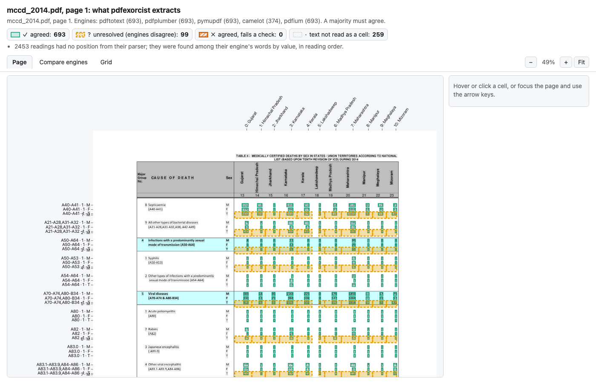
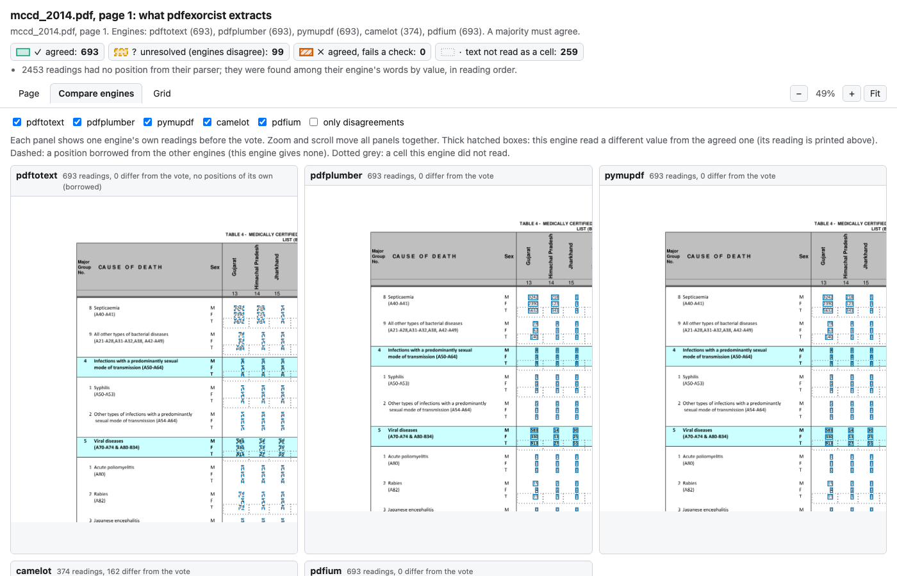
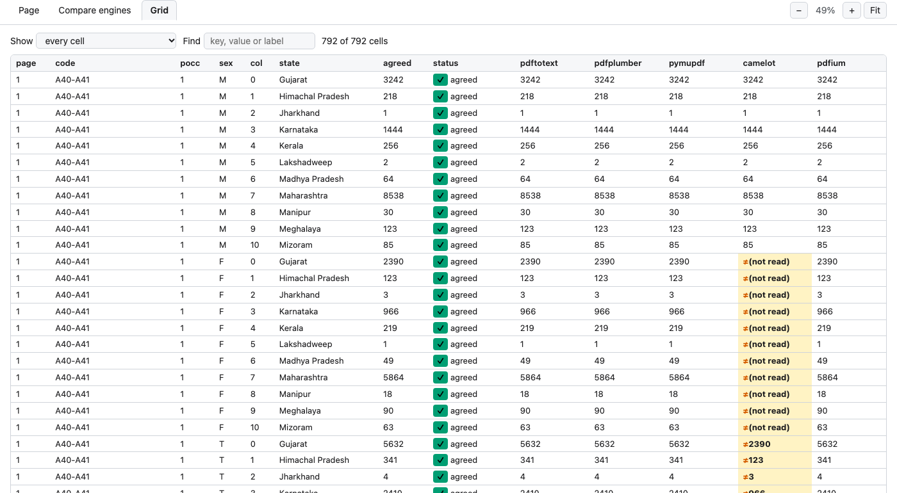
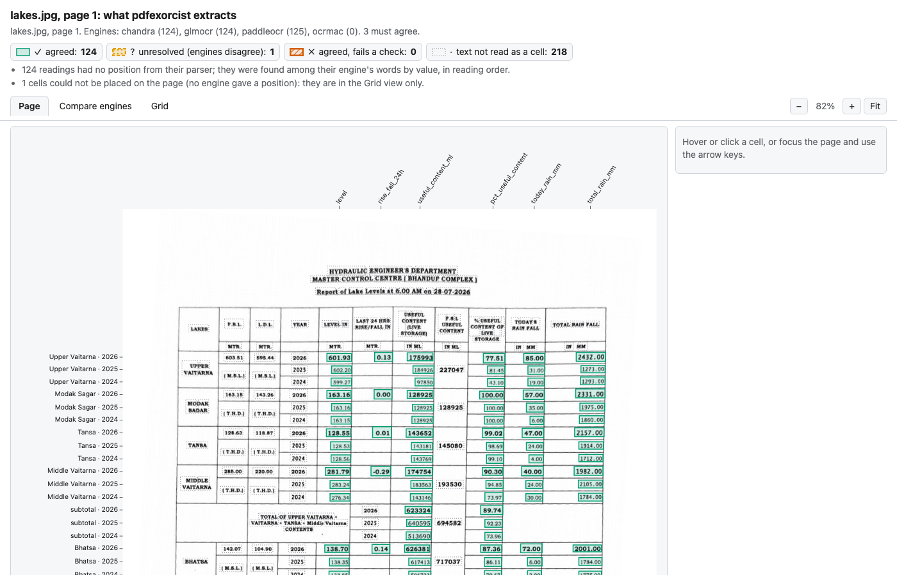
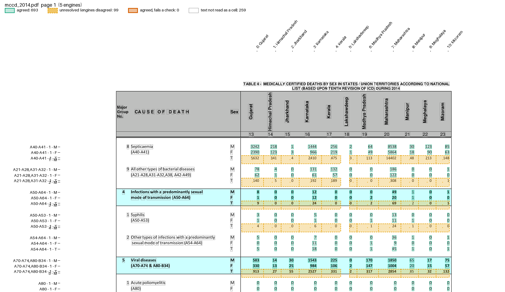

# See what it extracts

`show` draws one page with a box on every cell the vote produced. A shifted column or a skipped row is visible at a glance.

```bash
pdfexorcist show mccd_2014.pdf --recipe examples/mccd/table4.toml
```

```
Agreed             693  boxed solid
Unresolved          99  dashed, dotted fill
Failed checks        0  thick, hatched
Not read as cells  259  words outlined in grey
Wrote mccd_2014.p1.show.html
Open it in a browser (or add --open); it works offline.
```

The HTML file is self-contained and has three views. The screenshots below are of this file: `tests/fixtures/mccd/mccd_2014.pdf`, the MCCD Table 4 recipe, five text engines.

## Page



| Box | Meaning |
| --- | --- |
| green, solid | agreed value |
| orange, dashed with dots | unresolved: the engines disagreed |
| vermillion, hatched | agreed, but fails a check |
| grey, dotted | text that did not become a cell (titles, labels, notes) |

Row names run down the left margin and column names along the top; here the recipe names each column by its State. Hover or click a cell, or use the arrow keys, to see its key, the agreed value and every engine's reading. `U` jumps to the next unresolved cell.

The orange bands at each cause's T row are camelot's: it slips a row in these blocks and files the T values under a row with no cause code. No other engine reads a cell with that key, so they stay unresolved. The other four engines still agree on the real T cells, which are kept.

## Compare engines



One panel per engine, with its own readings before the vote. Zoom and scroll move every panel together. A reading that differs from the agreed value is hatched, with the engine's value printed above it. The header of each panel counts how many of its readings differ from the vote.

`compare` opens the same file on this view:

```bash
pdfexorcist compare mccd_2014.pdf --recipe examples/mccd/table4.toml
```

## Grid



One row per cell, one column per engine. Sort by any column, search by key, value or label, and filter for disagreements, unresolved, failed or unplaced cells. Here camelot has no reading for septicaemia's F row, and its T row holds the F values (`≠2390` where the others read 5632).

## Photos

A photographed page is shown levelled, as the OCR engines read it:

```bash
pdfexorcist show tests/fixtures/bmc/2026-07-28.jpg --recipe examples/lake_photo/recipe.toml
```



## A static picture

`--png` also writes an annotated PNG, and `-o page.png` writes only the PNG. Use it in a report or an issue.

```bash
pdfexorcist show mccd_2014.pdf --recipe examples/mccd/table4.toml --png
```



## Where the boxes come from

Positions come from the engines that report them: pdfplumber, PyMuPDF, PDFium, camelot, Tesseract, PaddleOCR and Apple Vision. pdftotext, Chandra and GLM-OCR give none, so their readings borrow the other engines' box, drawn dashed in Compare engines.

A parser need not return positions. pdfexorcist finds each value among its engine's words, in reading order. In Python, `extract(..., return_readings=True)` returns the same positions; see [Where each value sits](library.md#where-each-value-sits).
